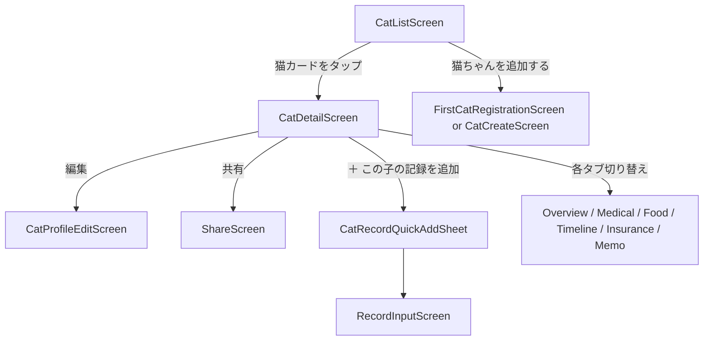
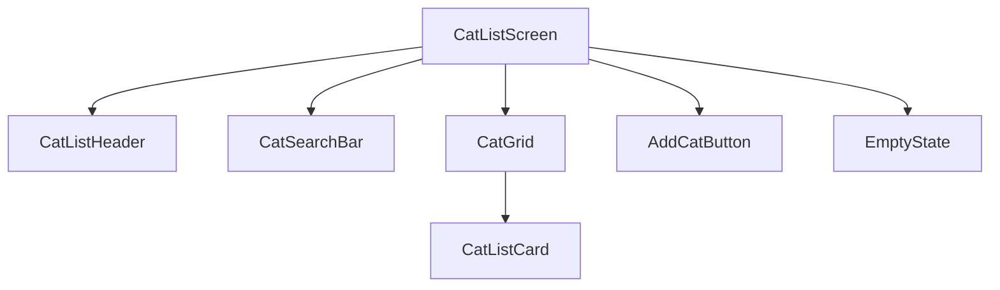
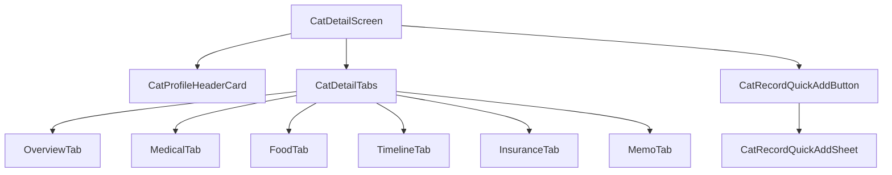

# ねこレコ 猫一覧・猫詳細画面設計

## 目的

このドキュメントは、ねこレコの「猫一覧画面」と「猫詳細画面」を Codex で実装するための仕様書です。

猫一覧・猫詳細画面は、ねこレコの中核となる画面です。  
ホーム画面が「今日やることを見る画面」であるのに対し、猫一覧・猫詳細画面は「その子のことを深く見る画面」です。

---

## 基本方針

- 猫一覧では、登録している猫を見分けやすく表示する
- 猫一覧では、詳細情報を出しすぎず、写真・名前・次の予定を中心にする
- 猫詳細では、1匹ごとの情報をカテゴリごとに整理する
- 情報量が多くなるため、猫詳細はタブで分ける
- 猫詳細から記録を追加する場合は、猫選択をスキップする
- 多頭飼育でも迷わず目的の猫にたどり着けるようにする

---

## 画面一覧

| 画面 | 画面ID | 役割 |
|---|---|---|
| 猫一覧画面 | `CatListScreen` | 登録済みの猫を一覧表示する |
| 猫詳細画面 | `CatDetailScreen` | 1匹の猫の情報をカテゴリごとに表示する |
| 猫プロフィール編集画面 | `CatProfileEditScreen` | 基本プロフィールを編集する |
| この子の記録追加シート | `CatRecordQuickAddSheet` | 対象猫を固定して記録を追加する |

---

## 画面フロー



---

# 1. 猫一覧画面

## 画面ID

`CatListScreen`

## 目的

登録している猫たちを一覧で見て、目的の子にすぐアクセスできるようにする。

---

## 画面タイトル

```text
ねこ一覧
```

---

## 表示形式

初期実装では **2列グリッド** を推奨する。

理由：

- 多頭飼いでも全体を見渡しやすい
- 写真で猫を判別しやすい
- 1列リストより画面の縦スクロール量を減らせる

---

## 画面構成



---

## 1-1. ヘッダー

## コンポーネント名

`CatListHeader`

## 表示内容

- タイトル
- 登録数
- 猫追加ボタン

## 表示例

```text
ねこ一覧
6匹のねこ
```

## アクション

### 猫追加ボタン

表示文言：

```text
＋ 追加
```

遷移先：

```ts
navigate('CatCreate')
```

初期実装では、オンボーディングで使った `FirstCatRegistrationScreen` を再利用してもよい。

---

## 1-2. 検索

## コンポーネント名

`CatSearchBar`

## 目的

猫の名前で検索できるようにする。

## プレースホルダー

```text
名前で検索
```

## 初期実装

- 名前の部分一致検索
- 大文字小文字は区別しない
- 検索文字列が空の場合は全件表示

---

## 1-3. フィルター・並び替え

初期実装では必須ではない。  
将来的に以下を追加できるようにする。

### フィルター候補

- 未完了タスクあり
- 通院予定あり
- 保険未請求あり
- 投薬中
- 記念日が近い

### 並び替え候補

- 登録順
- 名前順
- 年齢順
- 次の予定が近い順

---

## 1-4. 猫カード

## コンポーネント名

`CatListCard`

## 目的

猫の基本情報と次の予定を表示し、猫詳細画面への入口にする。

## 表示内容

| 表示項目 | 備考 |
|---|---|
| 写真 | 未設定の場合はデフォルト猫アイコン |
| 名前 | 必須 |
| 年齢 | 生年月日がある場合に表示 |
| 性別 | オス / メス / 不明 |
| 毛色・柄 | 登録がある場合に表示 |
| 次の予定 | 最も近い予定を1件表示 |
| 注意アイコン | 未完了タスクなどがある場合に表示 |
| 未完了タスク数 | ある場合のみ表示 |

---

## 表示例

```text
りお
推定7歳 / オス
キジ白
次回通院：28日後
未完了：1件
```

```text
まる
5歳 / メス
三毛
ワクチン：3日後
```

---

## アクション

カードをタップすると猫詳細画面へ遷移する。

```ts
navigate('CatDetail', { catId })
```

---

## 1-5. 空状態

猫が1匹も登録されていない場合に表示する。

## コンポーネント名

`CatListEmptyState`

## 文言

```text
猫ちゃんを登録しましょう
ねこレコは、猫ごとの情報をひとりずつ大切に記録できます。
```

## ボタン

```text
猫ちゃんを追加する
```

## アクション

```ts
navigate('CatCreate')
```

---

# 2. 猫詳細画面

## 画面ID

`CatDetailScreen`

## 目的

1匹の猫について、プロフィール・医療・ごはん・履歴・保険・メモをまとめて確認・編集できるようにする。

---

## 画面構成



---

## 2-1. プロフィールヘッダーカード

## コンポーネント名

`CatProfileHeaderCard`

## 目的

猫の顔と基本情報を最上部に表示する。

## 表示内容

- 写真
- 名前
- 年齢
- 性別
- 毛色・柄
- うちの子記念日
- 次の予定
- 注意アイコン
- 編集ボタン
- 共有ボタン
- メニューボタン

## 表示例

```text
りお
推定7歳 / オス
キジ白
うちの子記念日：2019年5月7日
次回通院：28日後
```

---

## ボタン

### 編集

```text
編集
```

アクション：

```ts
navigate('CatProfileEdit', { catId })
```

### 共有

```text
共有
```

アクション：

```ts
navigate('Share', { catId })
```

初期実装で共有機能が未実装の場合は disabled または非表示にしてよい。

### メニュー

将来的に以下を配置する。

- 並び替え
- 削除
- アーカイブ
- 共有設定

---

# 3. 猫詳細タブ

## コンポーネント名

`CatDetailTabs`

## タブ一覧

| タブ名 | tabId | 役割 |
|---|---|---|
| 概要 | `overview` | 基本情報とよく使う導線 |
| 医療 | `medical` | 医療・予防情報 |
| ごはん | `food` | フード・アレルギー・偏食対策 |
| 履歴 | `timeline` | 日付つき記録のタイムライン |
| 保険 | `insurance` | 保険情報と請求状況 |
| メモ | `memo` | 性格・注意事項・申し送り |

## 初期表示

```ts
defaultTab = 'overview'
```

---

# 4. 概要タブ

## コンポーネント名

`CatOverviewTab`

## 目的

その子の基本情報と、よく使う操作をまとめる。

## 表示内容

- 基本プロフィール
- 性格
- 注意事項
- 家族への申し送り
- 主治医
- 直近の予定
- よく使うアクション

---

## よく使うアクション

表示するボタン：

```text
体重を記録
通院を記録
フードを記録
メモを追加
```

## アクション

それぞれ対象猫を固定した状態で記録画面へ遷移する。

```ts
navigate('RecordInput', { catId, recordType: 'weight' })
navigate('RecordInput', { catId, recordType: 'hospital_visit' })
navigate('RecordInput', { catId, recordType: 'food' })
navigate('RecordInput', { catId, recordType: 'memo' })
```

---

# 5. 医療タブ

## コンポーネント名

`CatMedicalTab`

## 目的

医療・予防情報をまとめて表示する。

## 表示内容

- ワクチン履歴
- 次回ワクチン予定
- 駆虫薬履歴
- 次回駆虫薬予定
- 病歴
- 投薬
- 検査
- 避妊去勢
- 主治医
- 通院予定

## 操作

```text
ワクチンを追加
駆虫薬を追加
通院予定を追加
投薬を追加
病歴を編集
```

---

# 6. ごはんタブ

## コンポーネント名

`CatFoodTab`

## 目的

偏食対策として、猫ごとのフード情報を管理する。

## 表示内容

- いつものフード
- 好きなごはん
- 食べたごはん
- 食べなかったごはん
- 苦手なごはん
- アレルギー
- 食事メモ

## フードステータス

```ts
type FoodStatus =
  | 'favorite'
  | 'ate'
  | 'did_not_eat'
  | 'got_bored'
  | 'not_suitable'
```

## 表示文言

| status | 表示名 |
|---|---|
| `favorite` | よく食べる |
| `ate` | 食べた |
| `did_not_eat` | 食べなかった |
| `got_bored` | 飽きた |
| `not_suitable` | 体調に合わなかった |

## フードカード表示例

```text
ロイヤルカナン ○○
ステータス：よく食べる
メモ：小粒なら食べる。大袋は飽きやすい。
```

## 操作

```text
フードを追加
食べた記録を追加
アレルギーを編集
```

---

# 7. 履歴タブ

## コンポーネント名

`CatTimelineTab`

## 目的

その子の日付つき記録をタイムライン形式で表示する。

これは、既存のスプレッドシート管理表の「日付とメモ」の部分に相当する。

## 表示形式

- タイムライン
- 日付降順
- 記録タイプでフィルター可能

## 記録タイプ

```ts
type RecordType =
  | 'weight'
  | 'hospital_visit'
  | 'vaccine'
  | 'deworming'
  | 'medication'
  | 'food'
  | 'health_condition'
  | 'care'
  | 'insurance'
  | 'memo'
```

## フィルター

```text
すべて
医療
体重
フード
保険
メモ
```

## 表示例

```text
2026/05/07
体重：7.65kg
ワクチン接種。心臓エコー問題なし。
```

```text
2026/04/12
通院
血圧高め。次回4週間後。
```

## 操作

```text
記録を追加
フィルターを変更
記録詳細を見る
```

---

# 8. 保険タブ

## コンポーネント名

`CatInsuranceTab`

## 目的

ペット保険情報と請求状況を管理する。

## 表示内容

- 加入保険
- 保険プラン
- 証券番号
- 保険メモ
- 請求履歴
- 未請求一覧

## 請求ステータス

```ts
type InsuranceClaimStatus =
  | 'unclaimed'
  | 'preparing'
  | 'claimed'
  | 'paid'
  | 'not_applicable'
```

## 表示文言

| status | 表示名 |
|---|---|
| `unclaimed` | 未請求 |
| `preparing` | 請求準備中 |
| `claimed` | 請求済み |
| `paid` | 入金済み |
| `not_applicable` | 対象外 |

## 操作

```text
保険情報を編集
請求を追加
請求済みにする
入金済みにする
```

---

# 9. メモタブ

## コンポーネント名

`CatMemoTab`

## 目的

性格、注意事項、留守中の注意、家族への申し送りなど、自由度の高い情報を管理する。

## 表示内容

- 性格メモ
- 注意事項
- 苦手なこと
- 好きなこと
- 留守中の注意
- 家族への申し送り
- その他メモ

## メモカテゴリ

```ts
type MemoCategory =
  | 'personality'
  | 'care'
  | 'away'
  | 'hospital'
  | 'family'
  | 'other'
```

## 表示文言

| category | 表示名 |
|---|---|
| `personality` | 性格 |
| `care` | お世話 |
| `away` | 留守中 |
| `hospital` | 病院 |
| `family` | 家族への申し送り |
| `other` | その他 |

## 操作

```text
メモを追加
メモを編集
メモを削除
```

---

# 10. この子の記録を追加

## コンポーネント名

`CatRecordQuickAddButton`

## 表示文言

```text
＋ この子の記録を追加
```

## 表示位置

- 画面右下の Floating Action Button
- または画面下部固定ボタン

初期実装では、右下の Floating Action Button を推奨する。

---

## 記録追加シート

## コンポーネント名

`CatRecordQuickAddSheet`

## 目的

猫詳細画面から、その子に紐づく記録をすぐ追加できるようにする。

## 表示項目

```text
何を記録しますか？
```

## 選択肢

| 表示名 | recordType |
|---|---|
| 体重 | `weight` |
| 通院 | `hospital_visit` |
| 投薬 | `medication` |
| フード | `food` |
| 体調 | `health_condition` |
| 保険 | `insurance` |
| メモ | `memo` |

## 挙動

- 記録タイプを選択すると、対象猫を固定した状態で記録入力画面へ遷移する
- ホーム画面のクイック記録とは異なり、猫選択はスキップする

```ts
navigate('RecordInput', { catId, recordType })
```

---

# 11. データ取得仕様

## 猫一覧画面

```ts
type CatListScreenData = {
  cats: CatListItem[]
}
```

## CatListItem

```ts
type CatListItem = {
  id: string
  name: string
  photoUrl?: string | null

  sex: 'male' | 'female' | 'unknown'

  birthDate?: string | null
  birthDateType: 'exact' | 'estimated' | 'unknown'

  coatColorPattern?: string | null

  nextPlan?: {
    type:
      | 'hospital_visit'
      | 'vaccine'
      | 'deworming'
      | 'medication'
      | 'birthday'
      | 'adoption_anniversary'
      | 'insurance_claim'
    title: string
    scheduledDate: string
    daysUntil: number
  } | null

  hasWarning: boolean
  pendingTaskCount: number

  createdAt: string
  updatedAt: string
}
```

---

## 猫詳細画面

```ts
type CatDetailScreenData = {
  cat: Cat
  overview: CatOverview
  medical: CatMedical
  food: CatFood
  timeline: CatTimelineRecord[]
  insurance: CatInsurance
  memos: CatMemo[]
}
```

---

## Cat

```ts
type Cat = {
  id: string
  name: string
  photoUrl?: string | null

  sex: 'male' | 'female' | 'unknown'

  birthDate?: string | null
  birthDateType: 'exact' | 'estimated' | 'unknown'

  adoptionDate?: string | null
  adoptionDateType: 'exact' | 'unknown'

  breed?: string | null
  breedType: 'purebred' | 'mixed' | 'unknown'

  coatColorPattern?: string | null

  createdAt: string
  updatedAt: string
}
```

---

## CatOverview

```ts
type CatOverview = {
  personality?: string | null
  careNotes?: string | null
  familyNote?: string | null

  primaryHospitalName?: string | null
  primaryDoctorName?: string | null

  nextPlan?: {
    type: string
    title: string
    scheduledDate: string
    daysUntil: number
  } | null
}
```

---

## CatMedical

```ts
type CatMedical = {
  vaccineRecords: Array<{
    id: string
    date: string
    name?: string | null
    nextDate?: string | null
    note?: string | null
  }>

  dewormingRecords: Array<{
    id: string
    date: string
    name?: string | null
    nextDate?: string | null
    note?: string | null
  }>

  medications: Array<{
    id: string
    name: string
    dosage?: string | null
    schedule?: string | null
    startDate?: string | null
    endDate?: string | null
    note?: string | null
  }>

  medicalHistory?: string | null

  sterilizationStatus?: 'done' | 'not_done' | 'unknown'

  hospitalVisits: Array<{
    id: string
    date: string
    hospitalName?: string | null
    doctorName?: string | null
    diagnosis?: string | null
    note?: string | null
    nextVisitDate?: string | null
  }>
}
```

---

## CatFood

```ts
type CatFood = {
  regularFood?: string | null
  allergies?: string | null
  note?: string | null

  foodRecords: Array<{
    id: string
    name: string
    status: FoodStatus
    brand?: string | null
    flavor?: string | null
    shape?: string | null
    note?: string | null
    recordedAt: string
  }>
}
```

---

## CatTimelineRecord

```ts
type CatTimelineRecord = {
  id: string
  catId: string
  type: RecordType
  title: string
  body?: string | null
  recordedAt: string

  weightKg?: number | null
  relatedSourceId?: string | null

  createdAt: string
  updatedAt: string
}
```

---

## CatInsurance

```ts
type CatInsurance = {
  insuranceName?: string | null
  insurancePlan?: string | null
  insurancePolicyNumber?: string | null
  insuranceNote?: string | null

  claims: Array<{
    id: string
    visitDate?: string | null
    hospitalName?: string | null
    amount?: number | null
    status: InsuranceClaimStatus
    diagnosisName?: string | null
    receiptPhotoUrl?: string | null
    note?: string | null
    createdAt: string
    updatedAt: string
  }>
}
```

---

## CatMemo

```ts
type CatMemo = {
  id: string
  catId: string
  category: MemoCategory
  title?: string | null
  body: string
  createdAt: string
  updatedAt: string
}
```

---

# 12. 状態

## Loading

データ取得中。

```text
読み込み中...
```

またはスケルトン表示。

## Empty

猫一覧で猫がいない場合。

```text
猫ちゃんを登録しましょう
ねこレコは、猫ごとの情報をひとりずつ大切に記録できます。
```

## Error

データ取得に失敗した場合。

```text
情報を読み込めませんでした
時間をおいてもう一度お試しください。
```

ボタン：

```text
再読み込み
```

---

# 13. 並び順

## 猫一覧

初期実装：

1. 登録順
2. `createdAt` 昇順

将来的に以下を追加する。

- 名前順
- 年齢順
- 次の予定が近い順
- 未完了タスクあり優先

## 履歴タブ

- `recordedAt` の降順
- 新しい記録を上に表示

## フード記録

初期実装：

1. `favorite`
2. `ate`
3. `did_not_eat`
4. `got_bored`
5. `not_suitable`

同じステータスの場合は、新しい記録を上に表示する。

## 保険請求

初期実装：

1. 未請求
2. 請求準備中
3. 請求済み
4. 入金済み
5. 対象外

同じステータスの場合は、新しいものを上に表示する。

---

# 14. 推奨コンポーネント

## 画面コンポーネント

- `CatListScreen`
- `CatDetailScreen`
- `CatProfileEditScreen`

## 一覧系コンポーネント

- `CatListHeader`
- `CatSearchBar`
- `CatGrid`
- `CatListCard`
- `CatListEmptyState`

## 詳細系コンポーネント

- `CatProfileHeaderCard`
- `CatDetailTabs`
- `CatOverviewTab`
- `CatMedicalTab`
- `CatFoodTab`
- `CatTimelineTab`
- `CatInsuranceTab`
- `CatMemoTab`

## 共通コンポーネント

- `CatAvatar`
- `StatusBadge`
- `WarningIcon`
- `SectionCard`
- `PrimaryButton`
- `SecondaryButton`
- `FloatingActionButton`
- `EmptyState`
- `ErrorState`
- `LoadingSkeleton`

## 記録追加系コンポーネント

- `CatRecordQuickAddButton`
- `CatRecordQuickAddSheet`
- `RecordTypeOption`

---

# 15. UIトーン

## デザイン方針

- 一覧は写真中心で見分けやすくする
- 詳細はタブで整理し、情報を詰め込みすぎない
- 文字は小さくしすぎない
- カード単位で余白を取る
- 注意・未完了・期限切れだけを目立たせる
- 色を使いすぎない
- 猫写真が未設定の場合は、やさしい印象のデフォルト猫アイコンを表示する

---

# 16. アクセシビリティ

- 写真だけで猫を識別させず、名前を必ず表示する
- アイコンにはテキストまたはアクセシビリティラベルを設定する
- タップ領域は十分な大きさにする
- 色だけでステータスを表現しない
- タブ名は短く、読みやすいものにする
- フォントサイズ変更に対応しやすいレイアウトにする

---

# 17. 受け入れ条件

## 猫一覧

- 画面タイトルに「ねこ一覧」が表示される
- 登録済みの猫が2列グリッドで表示される
- 猫カードに写真、名前、年齢、性別、毛色・柄、次の予定が表示される
- 写真が未設定の場合、デフォルト猫アイコンが表示される
- 猫カードをタップすると猫詳細画面へ遷移する
- 猫がいない場合、空状態と「猫ちゃんを追加する」ボタンが表示される
- 名前検索で表示対象が絞り込まれる

## 猫詳細

- プロフィールヘッダーカードに写真、名前、年齢、性別、毛色・柄、うちの子記念日、次の予定が表示される
- 猫詳細画面に6つのタブが表示される
- 初期表示タブは概要である
- 概要タブに基本情報とよく使うアクションが表示される
- 医療タブにワクチン、駆虫薬、病歴、投薬、通院予定が表示される
- ごはんタブにフード情報と食べた・食べなかった記録が表示される
- 履歴タブにタイムライン形式で記録が表示される
- 保険タブに保険情報と請求ステータスが表示される
- メモタブにカテゴリ別メモが表示される

## 記録追加

- 「＋ この子の記録を追加」ボタンが表示される
- ボタンを押すと記録追加シートが開く
- 記録タイプを選ぶと、対象猫を固定した状態で記録入力画面へ遷移する
- 猫詳細から記録する場合、猫選択はスキップされる

## 状態表示

- データ取得中はローディング表示になる
- データ取得失敗時はエラー表示と再読み込みボタンが表示される

---

# 18. 初期実装でやること

初期実装では以下を対象とする。

- 猫一覧画面
- 2列グリッド表示
- 猫カード
- 名前検索
- 猫詳細画面
- プロフィールヘッダーカード
- 6タブ構成
- 概要タブ
- 医療タブの基本表示
- ごはんタブの基本表示
- 履歴タブのタイムライン表示
- 保険タブの基本表示
- メモタブの基本表示
- この子の記録を追加ボタン
- 記録追加シート
- ローディング状態
- 空状態
- エラー状態
- ローカルまたは仮データでの表示確認

---

# 19. 初期実装ではやらないこと

以下は初期実装では対象外とする。

- 家族共有の実処理
- 通知の実送信
- 保険請求の詳細フロー
- 領収書画像アップロード
- 体重グラフ
- 血液検査数値管理
- 複数端末同期
- 詳細な権限管理
- 猫一覧の高度なフィルター
- 猫一覧の並び替え
- インライン編集
- PDF出力
- 留守番モード

ただし、将来的に追加できるように、データ構造とコンポーネントは拡張しやすくしておく。
