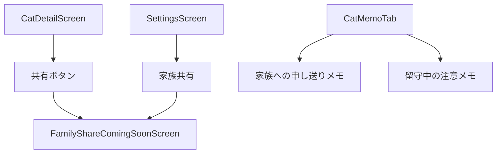
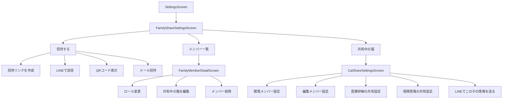
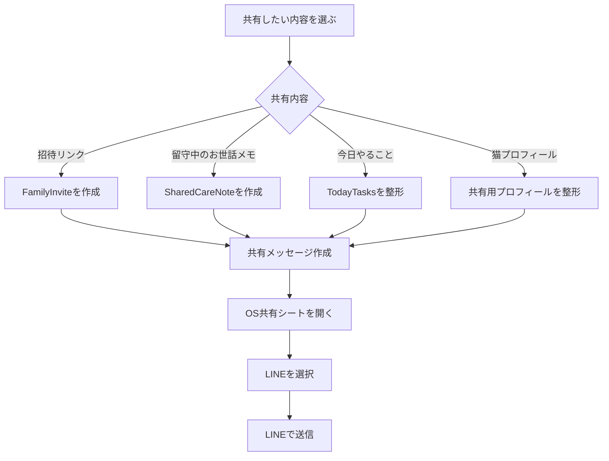

# ねこレコ 家族共有仕様

## 目的

このドキュメントは、ねこレコの「家族共有機能」を Codex で実装・将来拡張しやすい形に整理するための仕様書です。

家族共有機能は、猫ごとの情報を家族で共有し、留守中のお世話、投薬、通院予定、注意事項、保険請求状況などを家族の誰が見ても迷わず対応できる状態にすることを目的とします。

MVPでは家族共有の本実装は行わず、将来実装に向けた導線・データ構造・UI方針を先に設計します。

---

## 基本方針

- 家族共有は、単なる情報共有ではなく「お世話で迷わない状態」を作るための機能とする
- MVPでは本実装しない
- MVPでは、共有ボタン・設定画面の導線・近日公開表示を用意する
- MVPでは、家族への申し送りメモと留守中の注意メモを先行して実装する
- 将来的には、家庭単位の共有グループを作成できるようにする
- 将来的には、猫ごとに共有権限を設定できるようにする
- 医療情報・保険情報などの慎重に扱う情報は、権限で出し分ける
- LINEで送信できる導線を用意する
- 初期のLINE共有は、OSの共有シート経由で実装する

---

# 1. MVPでの扱い

## MVPでは本実装しない

家族共有は、ねこレコの重要な差別化要素ですが、MVPでは実装負荷が高いため本実装しません。

MVPでは、まず以下を実装します。

## MVPに入れるもの

| 項目 | 内容 |
|---|---|
| 猫詳細の共有ボタン | 将来共有への導線として表示 |
| 設定画面の家族共有導線 | 近日公開画面へ遷移 |
| 家族共有 近日公開画面 | 将来機能であることを説明 |
| 家族への申し送りメモ | 猫詳細のメモ・概要で表示 |
| 留守中の注意メモ | お世話・留守中メモとして管理 |
| 共有用データモデル | 将来拡張用に型を用意 |

---

## MVPではやらないもの

| 項目 | MVPでの扱い |
|---|---|
| 家族招待 | 対象外 |
| アカウント連携 | 対象外 |
| 権限管理 | 対象外 |
| 複数端末同期 | 対象外 |
| 家族ごとの通知 | 対象外 |
| 誰が記録したか | 対象外 |
| 誰が投薬完了したか | 対象外 |
| LINE専用API連携 | 対象外 |
| LINEログイン | 対象外 |

---

# 2. 家族共有の将来像

## 目的

将来的な家族共有では、以下のような利用シーンを想定します。

- 留守中にごはんを家族に任せる
- 投薬を家族にお願いする
- 通院後の注意事項を家族で確認する
- 保険請求が済んでいるか家族で確認する
- 誕生日やうちの子記念日を家族でお祝いする
- 家族の誰かがタスクを完了したら、他の家族にも反映される
- アプリを入れていない家族にも、LINEで必要情報だけ送る

---

# 3. 共有単位

## 方針

共有単位は、以下の2階層にする。

1. 家庭単位の共有グループ
2. 猫単位の共有権限

## 構造

```text
Household
├── HouseholdMember
├── HouseholdMember
└── Cats
    ├── Cat A
    ├── Cat B
    └── Cat C
```

## できるようにしたいこと

- 全猫を家族全員に共有
- 特定の猫だけ共有
- 閲覧のみ共有
- 編集可能で共有
- 保険情報だけ非表示
- 医療詳細だけ非表示
- 留守中に必要な情報だけ一時共有

---

# 4. ロール・権限

## ロール

将来的なロールは3種類とする。

| ロール | role | 概要 |
|---|---|---|
| オーナー | `owner` | すべて管理できる |
| 編集メンバー | `editor` | 記録や編集ができる |
| 閲覧メンバー | `viewer` | 閲覧のみできる |

---

## オーナー

できること：

- すべて閲覧
- すべて編集
- 家族招待
- メンバー削除
- 権限変更
- 猫の削除
- 共有解除
- 通知設定の管理
- 保険情報の管理

---

## 編集メンバー

できること：

- 猫情報を見る
- 記録を追加する
- タスクを完了する
- メモを書く
- フード記録を追加する
- 投薬完了を記録する

できないこと：

- 家族招待
- 権限変更
- 猫の削除
- 共有解除
- オーナー専用設定の変更

---

## 閲覧メンバー

できること：

- 猫情報を見る
- お世話メモを見る
- 留守中の注意を見る
- 今日やることを見る
- 近日予定を見る

できないこと：

- 記録追加
- 編集
- タスク完了
- 家族招待
- 権限変更
- 猫の削除

保険情報・医療詳細の閲覧は、猫ごとの共有設定に従う。

---

# 5. 共有方法

将来的には、以下の共有方法を用意します。

| 共有方法 | 用途 |
|---|---|
| 招待リンク | 家族を簡単に招待する |
| LINEで送信 | 招待リンクやお世話メモをLINEで共有する |
| QRコード | 同居家族にその場で共有する |
| メール招待 | メールアドレス宛に正式に招待する |
| OS共有シート | LINE、メール、メッセージなどへ送る |

---

## 5-1. 招待リンク

## 目的

家族をねこレコに招待するためのリンクを発行する。

## 仕様

- 招待リンクを作成できる
- 招待リンクをコピーできる
- 招待リンクをLINEで送れる
- 招待リンクをメールで送れる
- 有効期限を設定できる
- 招待された人がアプリを開いて参加できる

## 招待リンク文言例

```text
りおちゃんの情報をねこレコで共有しませんか？
招待リンクから参加できます。
```

---

## 5-2. LINEで送信

## 目的

日本の家族間コミュニケーションに合わせ、LINEで情報を共有しやすくする。

## 方針

初期実装では、LINE専用APIではなく、OSの共有シートからLINEを選ぶ方式にする。

将来的には、必要に応じて以下を検討する。

- LINEログイン
- LINE公式アカウント通知
- LINE Messaging API
- LINEでのリマインダー送信
- LINEからのタスク完了操作

---

## LINEで送信する情報

将来的には、以下をLINEで送信できるようにする。

- 家族招待リンク
- 猫プロフィールの共有リンク
- 留守中のお世話メモ
- 今日やること
- 投薬チェック
- 通院予定
- 緊急連絡先
- かかりつけ病院
- 保険情報を除いた簡易プロフィール

---

## LINE送信パターン

### A. 家族招待リンクをLINEで送る

目的：

家族をねこレコに招待する。

送信文例：

```text
りおちゃんの情報をねこレコで共有しませんか？
招待リンクから参加できます。
```

---

### B. 留守中のお世話メモをLINEで送る

目的：

相手がアプリを入れていなくても、必要なお世話情報を送れるようにする。

送信文例：

```text
今日のりおちゃんのお世話メモ

ごはん：ロイヤルカナンを少なめ
投薬：夜に1錠
注意：吐き戻しがあったら連絡してね
```

---

### C. 今日やることをLINEで送る

目的：

家族にその日のタスクをまとめて共有する。

送信文例：

```text
今日のねこレコ予定

りお：駆虫薬
まる：通院予定
むぎ：保険請求が未対応
```

---

## LINE送信の実装方針

MVPでは実装対象外。  
将来の初期実装では、以下のように進める。

```ts
type LineSharePayload = {
  title: string
  message: string
  url?: string | null
  source:
    | 'invite_link'
    | 'cat_profile'
    | 'away_care_note'
    | 'today_tasks'
    | 'hospital_plan'
}
```

実装イメージ：

```ts
shareToLine(payload: LineSharePayload)
```

初期はOS共有シートを利用する。

```ts
openShareSheet({
  title: payload.title,
  message: payload.message,
  url: payload.url
})
```

---

## 5-3. QRコード

## 目的

同居家族がその場で簡単に参加できるようにする。

## 仕様

- 招待リンクをQRコード化する
- 家族が読み取ると参加画面へ遷移する
- 有効期限つき
- 必要に応じて再生成できる

---

## 5-4. メール招待

## 目的

メールアドレス宛に正式に招待する。

## 仕様

- メールアドレスを入力する
- 招待メールを送る
- 招待リンクをメール内に含める
- 参加状態を確認できる

---

# 6. 共有する情報

## デフォルトで共有する情報

| 情報 | 共有 |
|---|---|
| 猫の基本プロフィール | 共有 |
| 猫の写真 | 共有 |
| 性別 | 共有 |
| 年齢 | 共有 |
| 毛色・柄 | 共有 |
| うちの子記念日 | 共有 |
| お世話メモ | 共有 |
| 留守中の注意 | 共有 |
| 今日やること | 共有 |
| 近日の予定 | 共有 |

---

## 設定で共有可にする情報

| 情報 | デフォルト |
|---|---|
| 通院履歴 | オーナーが設定 |
| 投薬履歴 | オーナーが設定 |
| 体重履歴 | オーナーが設定 |
| フード履歴 | オーナーが設定 |
| 保険情報 | オーナーが設定 |
| 保険請求ステータス | オーナーが設定 |
| メモ | オーナーが設定 |

---

## 慎重に扱う情報

以下の情報は、共有時に権限確認を行う。

- 保険証券番号
- 保険請求金額
- 病歴
- 診断名
- 領収書写真
- かかりつけ病院の連絡先
- 飼い主の連絡先
- 緊急連絡先

---

# 7. 家族共有画面

## 7-1. FamilyShareComingSoonScreen

## 画面ID

`FamilyShareComingSoonScreen`

## MVPでの役割

MVPでは、家族共有が近日公開であることを伝える画面として実装する。

## 表示文言

```text
家族共有は近日公開予定です

猫ちゃんのお世話メモ、通院予定、投薬、保険請求状況などを
家族で共有できる機能を準備しています。
```

## ボタン

```text
閉じる
```

---

## 7-2. FamilyShareSettingsScreen

## 画面ID

`FamilyShareSettingsScreen`

## 将来実装

家族共有の設定トップ画面。

## 表示内容

- 家族グループ名
- メンバー一覧
- 招待する
- 共有中の猫
- 猫ごとの共有設定
- LINEで招待リンクを送る
- QRコードで招待
- メールで招待

---

## 7-3. FamilyMemberDetailScreen

## 画面ID

`FamilyMemberDetailScreen`

## 将来実装

メンバーごとの権限設定画面。

## 表示内容

- メンバー名
- ロール
- 共有中の猫
- 猫ごとの権限
- 保険情報の閲覧可否
- 医療詳細の閲覧可否
- メンバー削除

---

## 7-4. CatShareSettingsScreen

## 画面ID

`CatShareSettingsScreen`

## 将来実装

猫ごとの共有設定画面。

## 表示内容

- この猫を共有する
- 閲覧可能メンバー
- 編集可能メンバー
- 保険情報を見せる
- 医療詳細を見せる
- メモを見せる
- LINEでこの子の情報を送る

---

# 8. 留守番モードとの関係

家族共有と留守番モードは密接に関連します。

## 将来の留守番モードで扱う情報

- 留守期間
- 担当者
- ごはん
- 投薬
- トイレ
- 注意事項
- 緊急連絡先
- かかりつけ病院
- 完了チェック
- LINEでお世話メモを送る

## 方針

留守番モードでは、家族共有の延長として、必要な情報だけを一時的に共有できるようにする。

---

# 9. 通知との関係

将来的には、通知を家族に共有できるようにする。

## 通知設定案

- 自分だけ通知
- 家族全員に通知
- 担当者だけ通知
- 留守番モード中だけ通知
- 投薬だけ家族にも通知
- 保険請求だけオーナーに通知

## 注意点

通知が多すぎると使われなくなるため、家族通知は細かくON/OFFできる必要がある。

---

# 10. 操作ログ

## 目的

家族共有では、誰が何をしたかを確認できることが重要です。

特に以下の操作はログに残す。

- 投薬した
- ごはんをあげた
- タスクを完了した
- 通院メモを書いた
- 保険請求済みにした
- 猫情報を編集した

---

## ActivityLog

```ts
type ActivityLog = {
  id: string
  catId: string
  actorUserId: string

  actionType:
    | 'record_created'
    | 'task_completed'
    | 'memo_added'
    | 'insurance_claim_updated'
    | 'cat_profile_updated'
    | 'share_permission_updated'

  targetType:
    | 'cat'
    | 'record'
    | 'task'
    | 'memo'
    | 'insurance_claim'
    | 'share_permission'

  targetId: string

  createdAt: string
}
```

MVPでは表示しなくてもよい。  
将来の家族共有・投薬完了者表示・操作履歴に利用する。

---

# 11. データモデル

## Household

```ts
type Household = {
  id: string
  name: string
  ownerUserId: string
  createdAt: string
  updatedAt: string
}
```

---

## HouseholdMember

```ts
type HouseholdMember = {
  id: string
  householdId: string
  userId: string

  displayName: string
  role: 'owner' | 'editor' | 'viewer'

  joinedAt?: string | null
  createdAt: string
  updatedAt: string
}
```

---

## CatSharePermission

```ts
type CatSharePermission = {
  id: string
  catId: string
  householdMemberId: string

  canView: boolean
  canEdit: boolean
  canManageReminders: boolean
  canManageInsurance: boolean
  canViewMedicalDetail: boolean
  canViewInsuranceDetail: boolean
  canViewPrivateMemo: boolean

  createdAt: string
  updatedAt: string
}
```

---

## FamilyInvite

```ts
type FamilyInvite = {
  id: string
  householdId: string

  inviteToken: string
  inviteUrl: string

  invitedByUserId: string
  invitedEmail?: string | null

  role: 'editor' | 'viewer'

  status:
    | 'pending'
    | 'accepted'
    | 'expired'
    | 'revoked'

  expiresAt: string

  createdAt: string
  updatedAt: string
}
```

---

## SharedCareNote

LINEや共有リンクで送る簡易お世話メモ。

```ts
type SharedCareNote = {
  id: string
  catId: string

  title: string
  body: string

  includesTodayTasks: boolean
  includesMedication: boolean
  includesHospitalInfo: boolean
  includesEmergencyContact: boolean

  shareUrl?: string | null

  createdByUserId: string
  createdAt: string
  updatedAt: string
}
```

---

# 12. 画面遷移

## MVPでの画面遷移



---

## 将来実装の画面遷移



---

## LINE送信フロー



---

# 13. ルートパラメータ

## FamilyShareComingSoonScreen

```ts
type FamilyShareComingSoonScreenParams = {
  source: 'settings' | 'cat_detail'
  catId?: string
}
```

---

## FamilyShareSettingsScreen

```ts
type FamilyShareSettingsScreenParams = {
  householdId: string
}
```

---

## FamilyMemberDetailScreen

```ts
type FamilyMemberDetailScreenParams = {
  householdId: string
  memberId: string
}
```

---

## CatShareSettingsScreen

```ts
type CatShareSettingsScreenParams = {
  catId: string
  householdId: string
}
```

---

## LineShareScreen / Sheet

```ts
type LineShareParams = {
  source:
    | 'invite_link'
    | 'cat_profile'
    | 'away_care_note'
    | 'today_tasks'
    | 'hospital_plan'

  catId?: string
  householdId?: string
  sharedCareNoteId?: string
  inviteId?: string
}
```

---

# 14. 受け入れ条件

## MVP

- 猫詳細画面に共有ボタンが表示される
- 共有ボタンを押すと、家族共有の近日公開画面が表示される
- 設定画面に家族共有の導線が表示される
- 設定画面から家族共有の近日公開画面へ遷移できる
- 猫詳細またはメモタブで家族への申し送りメモを表示できる
- 猫詳細またはメモタブで留守中の注意メモを表示できる
- 家族共有の本実装は行わない

---

## 将来実装

- 家族グループを作成できる
- 家族メンバーを招待できる
- 招待リンクを作成できる
- 招待リンクをLINEで送信できる
- QRコードで招待できる
- メールで招待できる
- メンバーごとにロールを設定できる
- 猫ごとに共有権限を設定できる
- 医療詳細の閲覧可否を設定できる
- 保険情報の閲覧可否を設定できる
- 留守中のお世話メモをLINEで送れる
- 今日やることをLINEで送れる
- 操作ログに誰が何をしたかを保存できる
- 家族通知のON/OFFを設定できる

---

# 15. 初期実装でやること

MVPで実装するもの：

- 猫詳細の共有ボタン
- 設定画面の家族共有導線
- `FamilyShareComingSoonScreen`
- 家族への申し送りメモ
- 留守中の注意メモ
- 将来用のデータモデル定義
- 将来用のルートパラメータ定義

---

# 16. 初期実装ではやらないこと

MVPでは以下を実装しない。

- 家族グループ作成
- 家族メンバー招待
- 招待リンク生成
- LINE送信
- QRコード招待
- メール招待
- 権限管理
- 複数端末同期
- 家族通知
- 操作ログ表示
- LINEログイン
- LINE公式アカウント通知
- LINE Messaging API連携

ただし、将来的に追加できるように、画面導線・データモデル・関数名は拡張しやすくしておく。

---

# 17. 企画書用まとめ

> 家族共有機能では、猫ごとの基本情報やお世話メモ、通院予定、投薬、保険請求状況などを家族で共有できるようにする。単なる情報共有ではなく、留守中のお世話や投薬、通院後の注意事項など、家族の誰が見ても迷わず対応できる状態を作ることを目的とする。MVPでは本実装せず、家族への申し送りメモや留守中の注意事項を先行して実装し、将来的に招待リンク・LINEで送信・QRコード・メール招待・権限管理・家族通知・操作ログへ拡張する。
