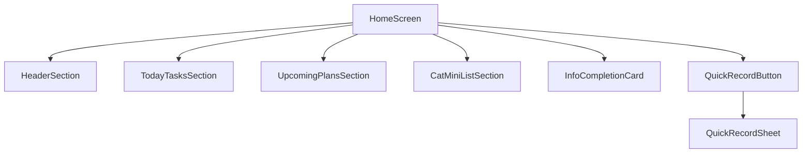

# ねこレコ ホーム画面設計

## 目的

このドキュメントは、ねこレコのホーム画面を Codex で実装するための仕様書です。

ホーム画面は、ねこレコの中心となる画面です。  
多頭飼い家庭において、「今日、猫たちに何をすればいいか」が一目でわかり、必要な記録をすぐに追加できることを目的とします。

---

## ホーム画面の役割

ホーム画面の主な役割は以下の3つです。

1. 今日やることがわかる
2. 近日中に対応すべき予定がわかる
3. すぐ記録できる

多頭飼いでは情報量が多くなりやすいため、ホーム画面ではすべての詳細情報を表示しません。  
通院履歴、体重推移、フード履歴、保険情報などの詳細は、猫ごとの詳細画面に分けます。

ホームでは、**今日見るべき情報**と**すぐ行動できる導線**に絞って表示します。

---

## 基本方針

- ホーム画面は「今日のねこたち」を中心に構成する
- 今日必要なタスクを最優先で表示する
- 近日中の予定は今日のタスクとは分けて表示する
- 猫一覧はミニ表示にして、詳細画面への入口にする
- クイック記録ボタンは常に押しやすい場所に置く
- タスクは猫ごとのカードで表示する
- タスクカード上で完了・記録・あとで対応ができるようにする
- 情報を詰め込みすぎず、1画面で状況が把握できるようにする

---

## 画面ID

`HomeScreen`

---

## 画面構成



---

# 1. ヘッダー

## コンポーネント名

`HomeHeader`

## 目的

ホーム画面のタイトル、日付、通知・共有への導線を表示する。

## 表示内容

- 画面タイトル
- 今日の日付
- 通知アイコン
- 家族共有アイコン

## 文言

### タイトル

```text
今日のねこたち
```

### 日付表示例

```text
2026年5月29日（金）
```

## UIメモ

- タイトルは大きめに表示する
- 日付はタイトル下に小さく表示する
- 右上に通知アイコンと家族共有アイコンを配置する
- 家族共有機能が未実装の場合は、アイコンを非表示または disabled にしてもよい

---

# 2. 今日やること

## コンポーネント名

`TodayTasksSection`

## 目的

今日対応が必要なタスクを最優先で表示する。

## セクションタイトル

```text
今日やること
```

## 表示対象

今日の日付に該当する以下のタスクを表示する。

- 投薬
- 通院
- ワクチン
- 駆虫薬
- 体重記録
- 保険請求
- ケア
- 誕生日
- うちの子記念日

## 表示条件

以下のいずれかに該当するものを表示する。

- `dueDate` が今日
- `reminderDate` が今日
- `status` が `pending`
- 保険請求が未対応
- 記念日が今日

---

## 今日やることカード

## コンポーネント名

`TodayTaskCard`

## 表示内容

- 猫の写真
- 猫の名前
- タスク種別
- タスク内容
- 期限または予定日
- ステータス
- アクションボタン

## 表示例

```text
りお
駆虫薬の予定日です
[完了] [あとで]
```

```text
まる
保険請求が未対応です
[請求済みにする]
```

```text
むぎ
今日はうちの子記念日です
[お祝いメモを書く]
```

---

## タスク種別

```ts
type TaskType =
  | 'medication'
  | 'hospital_visit'
  | 'vaccine'
  | 'deworming'
  | 'weight_record'
  | 'insurance_claim'
  | 'care'
  | 'birthday'
  | 'adoption_anniversary'
```

## タスクステータス

```ts
type TaskStatus =
  | 'pending'
  | 'completed'
  | 'snoozed'
```

---

## アクション

### 完了

対象タスクの `status` を `completed` にする。

表示文言：

```text
完了
```

### あとで

対象タスクの `status` を `snoozed` にする。  
初期実装では当日中の一時非表示でもよい。

表示文言：

```text
あとで
```

### 記録する

体重、通院、フード、体調などの記録追加画面またはクイック記録シートを開く。

表示文言：

```text
記録する
```

### 請求済みにする

保険請求ステータスを `claimed` に更新する。

表示文言：

```text
請求済みにする
```

---

## 空状態

今日やることがない場合は、空状態を表示する。

## 文言

```text
今日の予定はありません
みんな元気に過ごせますように。
```

## 表示するボタン

```text
記録を追加する
```

---

# 3. 近日の予定

## コンポーネント名

`UpcomingPlansSection`

## 目的

今日ではないが、近日中に対応が必要な予定を表示する。

## セクションタイトル

```text
近日の予定
```

## 表示範囲

初期設定では、今日を除く7日以内の予定を表示する。

```ts
const UPCOMING_DAYS_RANGE = 7
```

## 表示対象

- 通院予定
- ワクチン予定
- 駆虫薬予定
- 投薬開始予定
- 体重記録予定
- 誕生日
- うちの子記念日
- 保険請求期限

## 表示例

```text
3日後
りお：ワクチン予定
```

```text
5日後
そら：再診予定
```

```text
7日後
はな：誕生日
```

---

## 近日予定カード

## コンポーネント名

`UpcomingPlanCard`

## 表示内容

- 日付または「○日後」
- 猫の名前
- 予定種別
- 予定内容
- 猫の写真または小さいアイコン

## アクション

カードをタップすると、該当する予定詳細または猫詳細画面に遷移する。

---

## 空状態

近日の予定がない場合は、セクションを非表示にしてもよい。  
または以下の文言を表示する。

```text
近日中の予定はありません
```

初期実装では、ホームの情報量を減らすため、近日予定がない場合はセクションごと非表示でよい。

---

# 4. ねこ一覧ミニ表示

## コンポーネント名

`CatMiniListSection`

## 目的

登録済みの猫を一覧表示し、猫詳細画面への入口にする。

## セクションタイトル

```text
ねこ一覧
```

## 表示形式

- 横スクロールカード
- または2列グリッド

初期実装では、横スクロールカードを推奨する。

## 猫カード表示内容

- 写真
- 名前
- 年齢
- 注意アイコン
- 次の予定

## 表示例

```text
りお
推定7歳
次回通院：28日後
```

```text
まる
5歳
保険未請求あり
```

---

## 猫ミニカード

## コンポーネント名

`CatMiniCard`

## 表示内容

| 表示項目 | 備考 |
|---|---|
| 猫の写真 | 未設定の場合はデフォルト猫アイコン |
| 名前 | 必須 |
| 年齢 | 生年月日がある場合に表示 |
| 次の予定 | 最も近い予定を1件表示 |
| 注意アイコン | 未完了タスク、保険未請求、通院予定などがある場合に表示 |

## アクション

カードをタップすると、対象の猫詳細画面へ遷移する。

```ts
navigate('CatDetail', { catId })
```

---

# 5. 情報追加の案内カード

## コンポーネント名

`InfoCompletionCard`

## 目的

初回登録後、詳細情報が少ない猫に対して、追加登録を自然に促す。

## 表示条件

以下のいずれかに該当する場合に表示する。

- 登録直後の猫がいる
- ワクチン情報が未登録
- 主治医情報が未登録
- 保険情報が未登録
- フード情報が未登録
- 注意事項が未登録

## 表示頻度

- 表示は控えめにする
- ユーザーが閉じた場合は一定期間表示しない
- 何度もしつこく表示しない

## 文言

```text
りおちゃんの情報を追加しませんか？
ワクチン・保険・フードを登録すると、通知や管理がもっと便利になります。
```

## ボタン

```text
情報を追加する
あとで
```

## アクション

- 「情報を追加する」：追加情報カテゴリ選択画面、または猫詳細編集画面へ遷移
- 「あとで」：カードを一時的に非表示

---

# 6. クイック記録ボタン

## コンポーネント名

`QuickRecordButton`

## 目的

ホーム画面からすぐに記録を追加できる導線を提供する。

## 表示文言

```text
＋ 記録する
```

## 表示位置

- 画面右下の Floating Action Button
- または画面下部の固定ボタン

初期実装では、右下の Floating Action Button を推奨する。

## 挙動

タップすると、クイック記録シートを表示する。

---

# 7. クイック記録シート

## コンポーネント名

`QuickRecordSheet`

## 目的

少ない操作で記録タイプを選び、記録追加へ進める。

## 表示形式

- Bottom Sheet
- モーダル
- または画面遷移

初期実装では Bottom Sheet を推奨する。

## 表示項目

```text
何を記録しますか？
```

## 記録タイプ

| 表示名 | recordType | 初期実装 |
|---|---|---:|
| 体重 | `weight` | 必須 |
| 通院 | `hospital_visit` | 必須 |
| 投薬 | `medication` | 任意 |
| フード | `food` | 必須 |
| 体調 | `health_condition` | 必須 |
| 保険 | `insurance` | 必須 |
| メモ | `memo` | 必須 |

## 挙動

- 記録タイプを選択する
- 猫を選択する
- 各記録入力画面へ遷移、または簡易入力フォームを表示する

## 最短導線例：体重記録

```text
＋ 記録する
→ 体重
→ 猫を選ぶ
→ 体重を入力
→ 保存
```

診察室での利用を想定し、体重記録は特に少ない操作で保存できるようにする。

---

# 8. データ取得仕様

## ホーム画面で必要なデータ

ホーム画面では、以下のデータを取得する。

```ts
type HomeScreenData = {
  cats: Cat[]
  todayTasks: HomeTask[]
  upcomingPlans: UpcomingPlan[]
  infoCompletionSuggestions: InfoCompletionSuggestion[]
}
```

---

## Cat

```ts
type Cat = {
  id: string
  name: string
  photoUrl?: string | null
  sex: 'male' | 'female' | 'unknown'
  birthDate?: string | null
  birthDateType: 'exact' | 'estimated' | 'unknown'
  adoptionDate?: string | null
  adoptionDateType: 'exact' | 'unknown'
  breed?: string | null
  breedType: 'purebred' | 'mixed' | 'unknown'
  coatColorPattern?: string | null
  createdAt: string
  updatedAt: string
}
```

---

## HomeTask

```ts
type HomeTask = {
  id: string
  catId: string
  catName: string
  catPhotoUrl?: string | null

  type: TaskType
  title: string
  description?: string | null

  dueDate: string
  reminderDate?: string | null

  status: TaskStatus

  sourceType?:
    | 'vaccine'
    | 'deworming'
    | 'hospital_visit'
    | 'medication'
    | 'insurance_claim'
    | 'care'
    | 'anniversary'
    | 'manual'

  sourceId?: string | null

  createdAt: string
  updatedAt: string
}
```

---

## UpcomingPlan

```ts
type UpcomingPlan = {
  id: string
  catId: string
  catName: string
  catPhotoUrl?: string | null

  type:
    | 'hospital_visit'
    | 'vaccine'
    | 'deworming'
    | 'medication'
    | 'weight_record'
    | 'birthday'
    | 'adoption_anniversary'
    | 'insurance_claim'

  title: string
  scheduledDate: string
  daysUntil: number

  sourceId?: string | null
}
```

---

## InfoCompletionSuggestion

```ts
type InfoCompletionSuggestion = {
  id: string
  catId: string
  catName: string
  missingFields: Array<
    | 'vaccine'
    | 'deworming'
    | 'hospital'
    | 'insurance'
    | 'food'
    | 'care_notes'
  >
  message: string
  dismissedUntil?: string | null
}
```

---

# 9. ホーム画面の状態

## Loading

データ取得中。

表示例：

```text
読み込み中...
```

またはスケルトン表示。

## EmptyCats

猫が1匹も登録されていない状態。

表示文言：

```text
最初の猫ちゃんを登録しましょう
ねこレコは、猫ごとの情報をひとりずつ大切に記録できます。
```

ボタン：

```text
猫ちゃんを登録する
```

アクション：

```ts
navigate('FirstCatRegistration')
```

## NoTasks

猫は登録済みだが、今日やることがない状態。

表示文言：

```text
今日の予定はありません
みんな元気に過ごせますように。
```

ボタン：

```text
記録を追加する
```

## Error

データ取得に失敗した状態。

表示文言：

```text
ホーム情報を読み込めませんでした
時間をおいてもう一度お試しください。
```

ボタン：

```text
再読み込み
```

---

# 10. タスク生成ルール

ホーム画面の `todayTasks` は、各記録・予定データから生成する。

## ワクチン

- `nextVaccineDate` が今日の場合、今日やることに表示
- `nextVaccineDate` が7日以内の場合、近日の予定に表示

## 駆虫薬

- `nextDewormingDate` が今日の場合、今日やることに表示
- `nextDewormingDate` が7日以内の場合、近日の予定に表示

## 通院

- `nextHospitalVisitDate` が今日の場合、今日やることに表示
- `nextHospitalVisitDate` が7日以内の場合、近日の予定に表示

## 保険請求

- 保険請求ステータスが `unclaimed` の場合、今日やることに表示してもよい
- 期限日がある場合は、期限に応じて近日の予定にも表示する

## 記念日

- 誕生日が今日の場合、今日やることに表示
- うちの子記念日が今日の場合、今日やることに表示
- 7日以内の場合、近日の予定に表示

## 体重記録

初期実装では手動記録を基本とする。  
将来的には「前回記録から○日経過」でタスク生成できるようにする。

---

# 11. 並び順

## 今日やること

以下の優先順で並べる。

1. 通院
2. 投薬
3. ワクチン
4. 駆虫薬
5. 保険請求
6. 体重記録
7. ケア
8. 記念日

同じ優先度の場合は、猫の登録順または名前順で表示する。

## 近日の予定

- `scheduledDate` の昇順
- 同じ日付の場合は、タスク優先度順

## ねこ一覧

初期実装では登録順。  
将来的には並び替え対応を検討する。

---

# 12. 画面遷移

## ホームからの遷移

| 操作 | 遷移先 |
|---|---|
| 猫ミニカードをタップ | 猫詳細画面 |
| 今日やることカードをタップ | タスク詳細または対象記録画面 |
| 完了ボタン | ホーム上でステータス更新 |
| あとでボタン | ホーム上で一時非表示 |
| 近日予定カードをタップ | 予定詳細または猫詳細画面 |
| 情報を追加する | 追加情報カテゴリ選択または猫詳細編集画面 |
| ＋ 記録する | クイック記録シート |
| 通知アイコン | 通知一覧 |
| 家族共有アイコン | 共有画面 |

---

# 13. 推奨コンポーネント

## 画面コンポーネント

- `HomeScreen`

## セクションコンポーネント

- `HomeHeader`
- `TodayTasksSection`
- `UpcomingPlansSection`
- `CatMiniListSection`
- `InfoCompletionCard`

## カードコンポーネント

- `TodayTaskCard`
- `UpcomingPlanCard`
- `CatMiniCard`

## 操作コンポーネント

- `QuickRecordButton`
- `QuickRecordSheet`
- `TaskActionButton`
- `EmptyState`
- `ErrorState`
- `LoadingSkeleton`

---

# 14. UIトーン

## デザイン方針

- かわいいより、見やすいを優先する
- ただし冷たくならないよう、やわらかい印象にする
- 猫の写真を中心に使う
- 色を使いすぎない
- 注意・未完了・期限切れだけ色で目立たせる
- 文字は小さくしすぎない
- カード間の余白を十分に取る

## 推奨カラーイメージ

実装時にブランドカラーが決まるまでは、以下のような方向性とする。

- 背景：白または薄いベージュ
- メインカラー：ブラウン系
- サブカラー：淡いクリーム系
- 注意色：未完了や期限切れのみ目立つ色を使用

---

# 15. アクセシビリティ

- タップ領域は十分な大きさを確保する
- 猫の写真だけで情報を判断させない
- アイコンにはテキストラベルまたはアクセシビリティラベルを設定する
- 色だけでステータスを表現しない
- 文字サイズが大きくなっても崩れにくいレイアウトにする

---

# 16. 受け入れ条件

## 基本表示

- ホーム画面のタイトルに「今日のねこたち」が表示される
- 今日の日付が表示される
- 登録済みの猫がねこ一覧に表示される
- 猫の写真がない場合、デフォルトアイコンが表示される

## 今日やること

- 今日のタスクがある場合、今日やることセクションに表示される
- 今日のタスクがない場合、空状態が表示される
- タスクカードから完了操作ができる
- タスクカードからあとで操作ができる

## 近日の予定

- 7日以内の予定が近日の予定に表示される
- 今日の予定は近日の予定ではなく、今日やることに表示される
- 近日予定がない場合、セクションを非表示にできる

## ねこ一覧

- 猫ミニカードをタップすると猫詳細画面に遷移する
- 猫ごとに最も近い予定が1件表示される
- 未完了タスクがある猫には注意アイコンが表示される

## クイック記録

- 「＋ 記録する」ボタンがホーム画面から押せる
- ボタンを押すとクイック記録シートが開く
- 体重、通院、フード、体調、保険、メモの記録タイプが選択できる
- 体重記録は少ない操作で保存画面まで進める

## 空状態

- 猫が1匹もいない場合、猫登録を促す画面が表示される
- 今日の予定がない場合、やさしい文言の空状態が表示される

## エラー状態

- データ取得に失敗した場合、エラー文言と再読み込みボタンが表示される

---

# 17. 初期実装でやること

初期実装では、以下を対象とする。

- ホーム画面レイアウト
- ヘッダー表示
- 今日やること表示
- 近日の予定表示
- ねこ一覧ミニ表示
- 情報追加の案内カード
- クイック記録ボタン
- クイック記録シート
- 空状態
- エラー状態
- ローカルまたは仮データでの表示確認

---

# 18. 初期実装ではやらないこと

以下は初期ホーム画面実装では対象外とする。

- 通知の実送信
- 家族共有の実処理
- 保険請求の詳細フロー
- 通院履歴タイムライン
- 体重グラフ
- フード履歴の詳細管理
- 複数端末同期
- 権限管理
- 並び替え機能
- 詳細なタスク繰り返し設定

ただし、将来的に追加できるように、データ構造とコンポーネントは拡張しやすくしておく。
