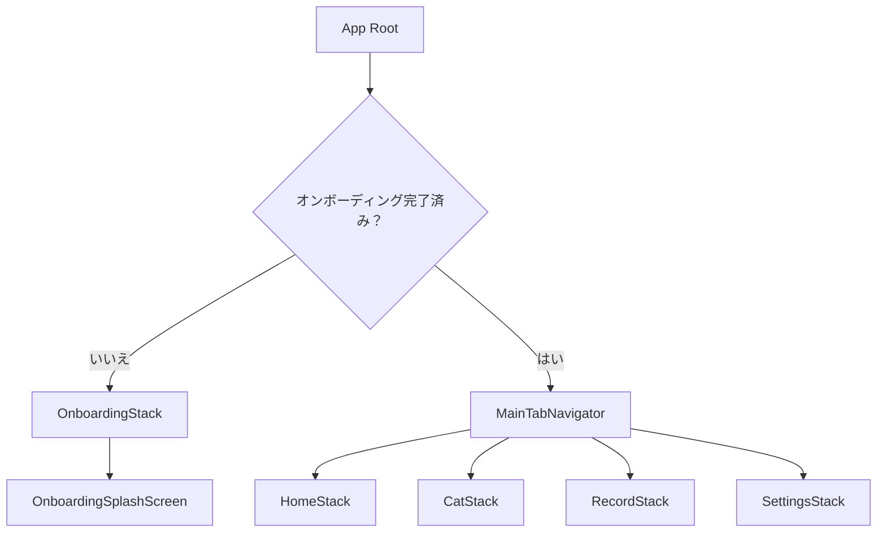
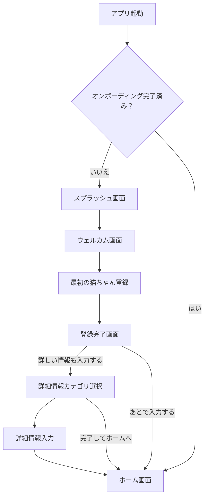
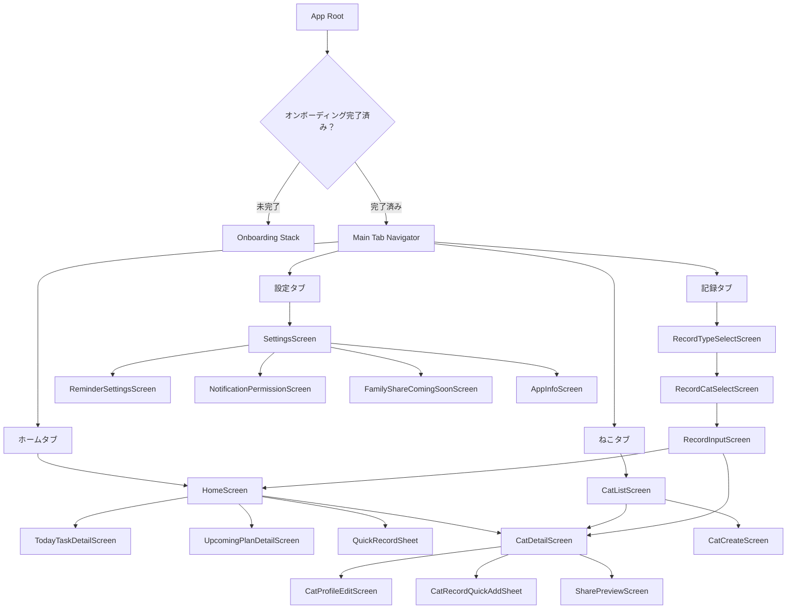
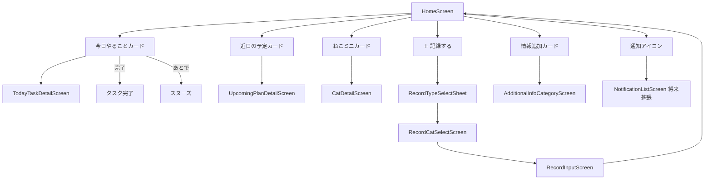
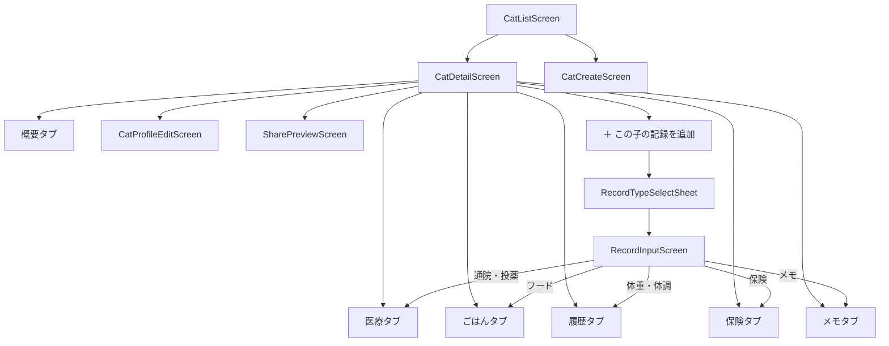
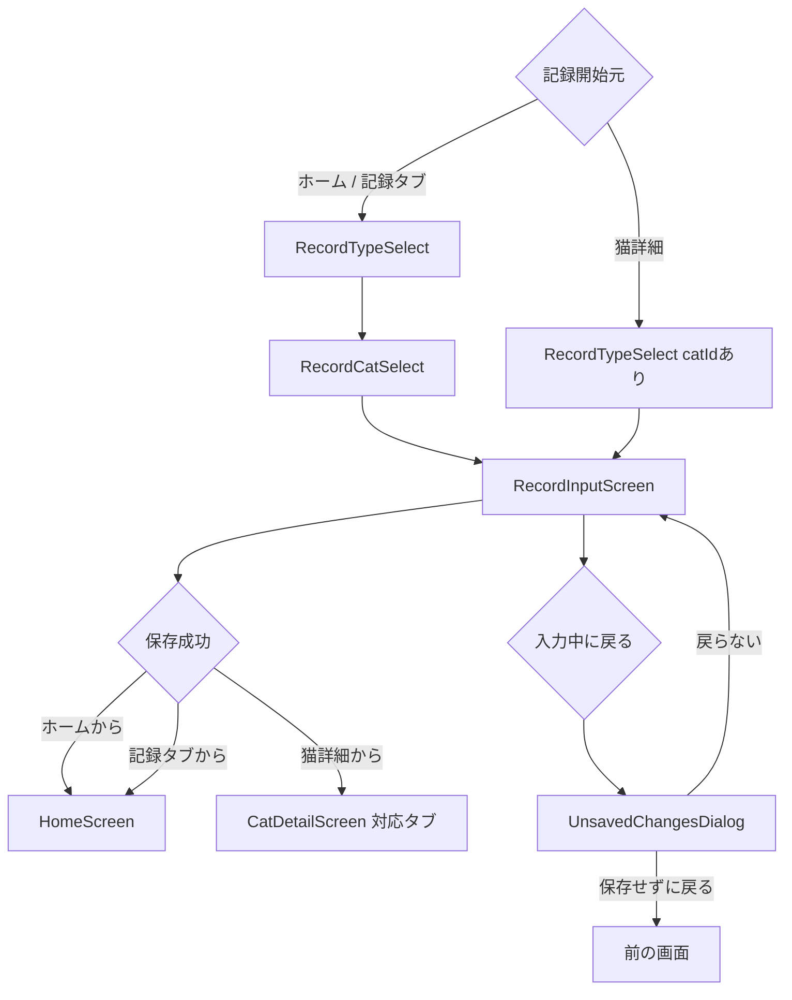
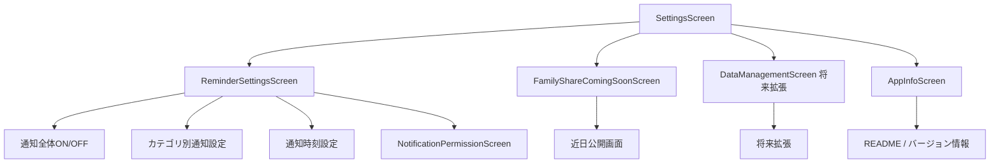

# ねこレコ ナビゲーション構成・画面遷移仕様

## 目的

このドキュメントは、ねこレコ MVP v1 のナビゲーション構成と画面遷移を Codex で実装しやすい形に整理するための仕様書です。

ねこレコは、ホーム、猫一覧・猫詳細、記録追加、通知設定など複数の機能を持つため、画面遷移が複雑になりやすいアプリです。  
MVPでは、下タブをシンプルに保ちつつ、日常利用で迷わず主要機能へアクセスできる構成にします。

---

## 基本方針

- MVPの下タブは4つに絞る
- 日常利用でよく使う機能を下タブに配置する
- 家族共有や留守番モードはMVPでは下タブに入れない
- 初回起動時のみオンボーディングを表示する
- オンボーディング完了後はメインタブへ遷移する
- 記録追加は、ホーム、猫詳細、記録タブの複数入口から利用できる
- 猫詳細から記録する場合は、対象猫が決まっているため猫選択をスキップする
- 画面遷移は Stack Navigator と Tab Navigator を組み合わせる想定にする

---

# 1. 下タブ構成

MVPでは、下タブを以下の4つにする。

| タブ名 | Stack ID | 役割 |
|---|---|---|
| ホーム | `HomeStack` | 今日やること、近日の予定、クイック記録 |
| ねこ | `CatStack` | 猫一覧、猫詳細、猫編集 |
| 記録 | `RecordStack` | 記録タイプ選択、猫選択、記録入力 |
| 設定 | `SettingsStack` | 通知設定、アプリ情報、将来の共有導線 |

## MVPでは下タブに入れないもの

| 機能 | MVPでの扱い |
|---|---|
| 共有 | 猫詳細・設定内に導線のみ配置 |
| 通知一覧 | 将来拡張 |
| 留守番モード | 将来拡張 |
| PDF出力 | 将来拡張 |
| 保護猫活動者向け専用機能 | 将来拡張 |

---

# 2. Navigator構成

## 推奨構成

```text
RootNavigator
├── OnboardingStack
│   ├── OnboardingSplashScreen
│   ├── OnboardingWelcomeScreen
│   ├── FirstCatRegistrationScreen
│   ├── CatRegistrationCompleteScreen
│   ├── AdditionalInfoCategoryScreen
│   └── AdditionalInfoInputScreen
│
└── MainTabNavigator
    ├── HomeStack
    │   ├── HomeScreen
    │   ├── TodayTaskDetailScreen
    │   ├── UpcomingPlanDetailScreen
    │   ├── AdditionalInfoCategoryScreen
    │   └── RecordInputScreen
    │
    ├── CatStack
    │   ├── CatListScreen
    │   ├── CatDetailScreen
    │   ├── CatCreateScreen
    │   ├── CatProfileEditScreen
    │   ├── SharePreviewScreen
    │   └── RecordInputScreen
    │
    ├── RecordStack
    │   ├── RecordTypeSelectScreen
    │   ├── RecordCatSelectScreen
    │   └── RecordInputScreen
    │
    └── SettingsStack
        ├── SettingsScreen
        ├── ReminderSettingsScreen
        ├── NotificationPermissionScreen
        ├── FamilyShareComingSoonScreen
        └── AppInfoScreen
```

---

# 3. RootNavigator

## 役割

アプリ起動時に、オンボーディングを表示するか、メインタブを表示するかを判定する。

## 判定条件

```ts
type RootNavigationState = {
  hasCompletedOnboarding: boolean
}
```

## 挙動

| 条件 | 遷移先 |
|---|---|
| `hasCompletedOnboarding === false` | `OnboardingStack` |
| `hasCompletedOnboarding === true` | `MainTabNavigator` |

## 画面遷移図：RootNavigator



---

# 4. 初回オンボーディング遷移

## 画面一覧

| 画面ID | 役割 |
|---|---|
| `OnboardingSplashScreen` | ロゴ・キャッチコピー表示 |
| `OnboardingWelcomeScreen` | アプリの価値説明 |
| `FirstCatRegistrationScreen` | 最初の猫登録 |
| `CatRegistrationCompleteScreen` | 登録完了と分岐 |
| `AdditionalInfoCategoryScreen` | 詳細情報カテゴリ選択 |
| `AdditionalInfoInputScreen` | 詳細情報入力 |

## 画面遷移図：初回オンボーディング



## オンボーディング完了フラグ保存タイミング

以下のいずれかで `hasCompletedOnboarding` を `true` にする。

- 登録完了画面で「あとで入力する」を押したとき
- 詳細情報カテゴリ選択画面で「完了してホームへ」を押したとき
- 詳細情報入力画面で「完了してホームへ」を押したとき

---

# 5. MainTabNavigator

## タブ一覧

| タブ | 初期画面 | 説明 |
|---|---|---|
| ホーム | `HomeScreen` | 今日やることを見る |
| ねこ | `CatListScreen` | 猫一覧から詳細へ入る |
| 記録 | `RecordTypeSelectScreen` | 記録追加を開始する |
| 設定 | `SettingsScreen` | 通知設定やアプリ情報 |

## 画面遷移図：アプリ全体



---

# 6. HomeStack

## 役割

ホーム画面を中心に、今日やること、近日予定、クイック記録へ遷移する。

## 画面一覧

| 画面 / UI | ID | 役割 |
|---|---|---|
| ホーム画面 | `HomeScreen` | 今日やること・近日予定の表示 |
| 今日やること詳細 | `TodayTaskDetailScreen` | タスクの詳細確認 |
| 近日予定詳細 | `UpcomingPlanDetailScreen` | 予定詳細確認 |
| クイック記録シート | `QuickRecordSheet` | 記録タイプ選択 |
| 詳細情報カテゴリ | `AdditionalInfoCategoryScreen` | 情報追加カードからの遷移 |
| 記録入力 | `RecordInputScreen` | 記録追加 |

## 画面遷移図：ホーム周り



## HomeStackの主な遷移

| 操作 | 遷移先 |
|---|---|
| 今日やることカードをタップ | `TodayTaskDetailScreen` |
| 今日やることの完了 | ホーム上で状態更新 |
| 今日やることのあとで | ホーム上でスヌーズ |
| 近日の予定カードをタップ | `UpcomingPlanDetailScreen` |
| ねこミニカードをタップ | `CatDetailScreen` |
| ＋記録する | `RecordTypeSelectSheet` |
| 情報追加カード | `AdditionalInfoCategoryScreen` |

---

# 7. CatStack

## 役割

猫一覧、猫詳細、猫編集、猫ごとの記録追加を管理する。

## 画面一覧

| 画面 / UI | ID | 役割 |
|---|---|---|
| 猫一覧 | `CatListScreen` | 猫を一覧表示 |
| 猫詳細 | `CatDetailScreen` | 猫ごとの詳細表示 |
| 猫追加 | `CatCreateScreen` | 2匹目以降の猫登録 |
| 猫プロフィール編集 | `CatProfileEditScreen` | 基本プロフィール編集 |
| 共有プレビュー | `SharePreviewScreen` | 将来共有の導線 |
| 記録追加シート | `CatRecordQuickAddSheet` | 対象猫固定で記録追加 |
| 記録入力 | `RecordInputScreen` | 記録フォーム |

## 画面遷移図：猫一覧・猫詳細周り



## CatStackの主な遷移

| 操作 | 遷移先 |
|---|---|
| 猫カードをタップ | `CatDetailScreen` |
| 猫ちゃんを追加する | `CatCreateScreen` |
| 編集ボタン | `CatProfileEditScreen` |
| 共有ボタン | `SharePreviewScreen` または近日公開表示 |
| ＋この子の記録を追加 | `CatRecordQuickAddSheet` |
| 記録タイプ選択 | `RecordInputScreen` |
| 記録保存 | `CatDetailScreen` の対応タブ |

---

# 8. RecordStack

## 役割

下タブの「記録」から記録追加を開始する。

## 画面一覧

| 画面 / UI | ID | 役割 |
|---|---|---|
| 記録タイプ選択 | `RecordTypeSelectScreen` | 何を記録するか選ぶ |
| 猫選択 | `RecordCatSelectScreen` | どの猫の記録か選ぶ |
| 記録入力 | `RecordInputScreen` | 記録内容を入力する |
| 離脱確認 | `UnsavedChangesDialog` | 入力途中の戻る確認 |

## 画面遷移図：記録追加周り



## 遷移元ごとの挙動

| 遷移元 | catId | 猫選択 | 保存後 |
|---|---:|---|---|
| ホーム | なし | 必要 | `HomeScreen` |
| 記録タブ | なし | 必要 | `HomeScreen` |
| 猫詳細 | あり | 不要 | `CatDetailScreen` の対応タブ |

## 記録保存後の戻り先

| recordType | 戻り先タブ |
|---|---|
| `weight` | 履歴 |
| `hospital_visit` | 医療 または 履歴 |
| `medication` | 医療 または 履歴 |
| `food` | ごはん |
| `health_condition` | 履歴 |
| `insurance` | 保険 |
| `memo` | メモ |

---

# 9. SettingsStack

## 役割

通知設定、通知許可、家族共有の将来導線、アプリ情報を管理する。

## 画面一覧

| 画面 | ID | 役割 |
|---|---|---|
| 設定トップ | `SettingsScreen` | 設定項目一覧 |
| 通知設定 | `ReminderSettingsScreen` | 通知カテゴリ別設定 |
| 通知許可 | `NotificationPermissionScreen` | OS通知許可導線 |
| 家族共有 近日公開 | `FamilyShareComingSoonScreen` | 将来機能の案内 |
| アプリ情報 | `AppInfoScreen` | バージョン・README等 |

## 画面遷移図：設定周り



## SettingsStackの主な遷移

| 操作 | 遷移先 |
|---|---|
| 通知設定を開く | `ReminderSettingsScreen` |
| 通知許可を設定する | `NotificationPermissionScreen` |
| 家族共有を開く | `FamilyShareComingSoonScreen` |
| アプリ情報を開く | `AppInfoScreen` |

---

# 10. クロススタック遷移

MVPでは、以下のようなクロススタック遷移が発生する。

## ホームから猫詳細へ

ホームのねこミニカードをタップした場合。

```ts
navigate('CatStack', {
  screen: 'CatDetailScreen',
  params: { catId }
})
```

## ホームから記録追加へ

ホームの `＋ 記録する` から記録を追加する。

```ts
openSheet('RecordTypeSelectSheet', {
  source: 'home'
})
```

記録タイプ選択後：

```ts
navigate('RecordCatSelectScreen', {
  source: 'home',
  recordType
})
```

## 猫詳細から記録追加へ

猫詳細の `＋ この子の記録を追加` から記録を追加する。

```ts
openSheet('RecordTypeSelectSheet', {
  source: 'cat_detail',
  catId
})
```

記録タイプ選択後：

```ts
navigate('RecordInputScreen', {
  source: 'cat_detail',
  catId,
  recordType
})
```

## 設定から通知許可へ

```ts
navigate('NotificationPermissionScreen')
```

---

# 11. ルートパラメータ

## CatDetailScreen

```ts
type CatDetailScreenParams = {
  catId: string
  initialTab?: 'overview' | 'medical' | 'food' | 'timeline' | 'insurance' | 'memo'
}
```

## CatProfileEditScreen

```ts
type CatProfileEditScreenParams = {
  catId: string
}
```

## RecordTypeSelectScreen / Sheet

```ts
type RecordTypeSelectParams = {
  source: 'home' | 'record_tab' | 'cat_detail'
  catId?: string
}
```

## RecordCatSelectScreen

```ts
type RecordCatSelectScreenParams = {
  source: 'home' | 'record_tab'
  recordType: RecordType
}
```

## RecordInputScreen

```ts
type RecordInputScreenParams = {
  source: 'home' | 'record_tab' | 'cat_detail'
  catId: string
  recordType: RecordType
}
```

## AdditionalInfoCategoryScreen

```ts
type AdditionalInfoCategoryScreenParams = {
  catId: string
  source: 'onboarding' | 'home' | 'cat_detail'
}
```

## AdditionalInfoInputScreen

```ts
type AdditionalInfoInputScreenParams = {
  catId: string
  categoryId:
    | 'medical_prevention'
    | 'hospital_insurance'
    | 'food'
    | 'care_notes'
    | 'anniversary_notifications'
}
```

---

# 12. タブ表示ルール

## 表示するタブ

MVPでは常に以下の4タブを表示する。

- ホーム
- ねこ
- 記録
- 設定

## 表示しないタブ

- 共有
- 通知一覧
- 留守番
- PDF

---

# 13. 戻る操作

## 基本ルール

- Stack内の画面は通常の戻る操作で前画面に戻る
- 記録入力画面で未保存入力がある場合は離脱確認を表示する
- オンボーディング完了後は、戻る操作でオンボーディング画面に戻らない
- 保存完了後は、遷移元に応じてホームまたは猫詳細へ戻る

## 離脱確認

記録入力、猫登録、プロフィール編集などで未保存入力がある場合。

```text
入力中の内容があります
保存せずに戻りますか？
```

ボタン：

```text
戻らない
保存せずに戻る
```

---

# 14. 受け入れ条件

## Root

- 初回起動時はオンボーディングが表示される
- オンボーディング完了後はホーム画面が表示される
- オンボーディング完了後の再起動では、メインタブが表示される

## MainTab

- 下タブに「ホーム」「ねこ」「記録」「設定」が表示される
- 共有タブ、留守番タブ、通知一覧タブは表示されない
- 各タブをタップすると該当Stackの初期画面へ移動できる

## HomeStack

- ホームから猫詳細へ遷移できる
- ホームから記録追加を開始できる
- ホームから情報追加カテゴリへ遷移できる
- 今日やることカード、近日予定カードから詳細へ遷移できる

## CatStack

- 猫一覧から猫詳細へ遷移できる
- 猫一覧から猫追加へ遷移できる
- 猫詳細からプロフィール編集へ遷移できる
- 猫詳細から対象猫固定で記録追加できる
- 記録保存後、猫詳細の対応タブへ戻れる

## RecordStack

- 記録タブから記録タイプ選択を開始できる
- 記録タブからは猫選択が表示される
- 猫詳細から記録する場合、猫選択は表示されない
- 記録保存後、遷移元に応じて適切な画面へ戻る

## SettingsStack

- 設定から通知設定へ遷移できる
- 設定から通知許可画面へ遷移できる
- 設定から家族共有の近日公開画面へ遷移できる
- 設定からアプリ情報へ遷移できる

## 戻る操作

- 未保存入力がある場合、離脱確認が表示される
- オンボーディング完了後は、戻る操作でオンボーディングに戻らない

---

# 15. 初期実装でやること

- `RootNavigator` の実装
- `OnboardingStack` の実装
- `MainTabNavigator` の実装
- `HomeStack` の実装
- `CatStack` の実装
- `RecordStack` の実装
- `SettingsStack` の実装
- 4タブ表示
- オンボーディング完了判定
- 主要画面間の遷移
- 記録追加時の `source` と `catId` に応じた分岐
- 猫詳細の `initialTab` 遷移
- 未保存入力の離脱確認

---

# 16. 初期実装ではやらないこと

- 家族共有の本実装
- 留守番モードの画面遷移
- 通知一覧画面の本実装
- PDF出力画面
- 譲渡用プロフィール画面
- 保護猫活動者向け専用ナビゲーション
- 複数アカウント切り替え
- 権限別の画面出し分け

ただし、将来的に追加できるように Stack と Params は拡張しやすくしておく。
