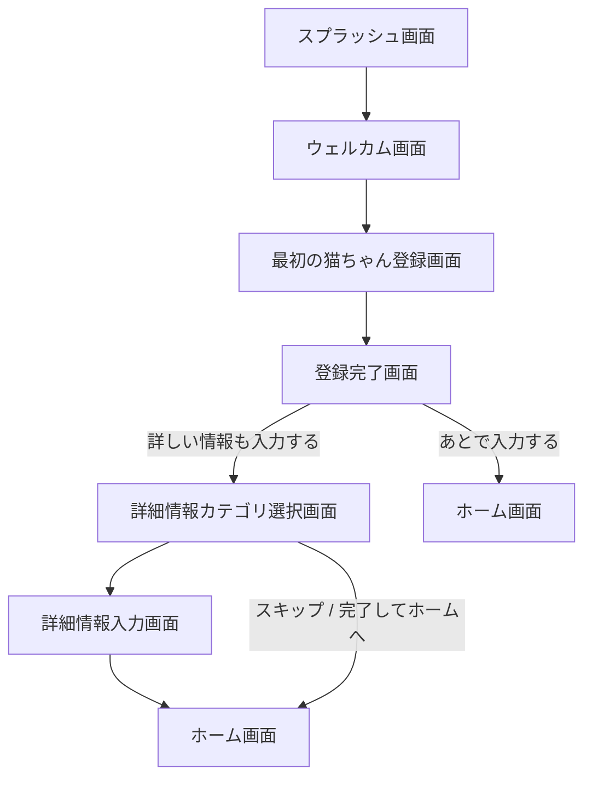

# ねこレコ 初回オンボーディング画面設計

## 目的

このドキュメントは、ねこレコの初回オンボーディング画面を Codex で実装するための仕様書です。

ねこレコの初回オンボーディングでは、ユーザーが最初の猫を迷わず登録できることを最優先にします。  
初回登録では入力負担を抑えつつ、登録後に「詳しい情報も入力する」と「あとで入力する」の2つの導線を用意します。

---

## 基本方針

- 初回登録は迷わせない
- 詳細管理は押しつけない
- 最初の猫を登録するところまでを最短で完了できるようにする
- 生年月日や血統が不明な猫でも登録できるようにする
- 登録後に、詳しい情報を入力するか、すぐホームへ進むかを選べるようにする
- UIはシンプルで見やすく、あたたかみのある印象にする

---

## 画面フロー



---

# 1. スプラッシュ画面

## 画面ID

`OnboardingSplashScreen`

## 目的

アプリ起動時にロゴとコンセプトを表示し、ねこレコの世界観を伝える。

## 表示内容

- ロゴ
- アプリ名
- キャッチコピー

## 文言

```text
ねこレコ
たくさんの“うちの子”を、ひとりずつ大切に記録。
```

## 挙動

- 1.5〜2秒表示後、ウェルカム画面へ自動遷移
- すでにオンボーディング完了済みの場合はホーム画面へ遷移
- 初回起動時のみ表示

## 実装メモ

- ロゴ画像がある場合は中央に配置
- 背景は白または薄いベージュ系
- アプリ名は太字
- キャッチコピーは小さめの文字で表示

---

# 2. ウェルカム画面

## 画面ID

`OnboardingWelcomeScreen`

## 目的

ねこレコでできることを短く伝え、ユーザーを初回登録へ誘導する。

## 表示内容

- タイトル
- 説明文
- できること3つ
- はじめるボタン

## 文言

### タイトル

```text
ねこレコへようこそ
```

### 説明文

```text
猫ごとの健康・ごはん・通院・記念日を、家族でわかりやすく管理できます。
```

### できること

```text
猫ごとの情報をまとめて管理
通院・ワクチン・駆虫薬を通知
家族とお世話情報を共有
```

### ボタン

```text
はじめる
```

## 挙動

- 「はじめる」を押すと、最初の猫ちゃん登録画面へ遷移

## UIメモ

- できることは3つのカード、またはアイコン付きリストで表示
- 説明しすぎず、1画面で収まる情報量にする

---

# 3. 最初の猫ちゃん登録画面

## 画面ID

`FirstCatRegistrationScreen`

## 目的

最初の猫のプロフィールを登録する。

## 画面タイトル

```text
最初の猫ちゃんを登録しましょう
```

## 補足文

```text
あとから変更・追加できます。わかる範囲で入力してください。
```

---

## 入力項目

| 項目 | フィールド名 | 型 | 必須 | 備考 |
|---|---|---:|---:|---|
| 写真 | `photoUrl` | string / file | 任意 | 画像選択。あとで設定可能 |
| 名前 | `name` | string | 必須 | 空欄不可 |
| 性別 | `sex` | enum | 必須 | `male`, `female`, `unknown` |
| 生年月日 | `birthDate` | date / null | 任意 | 不明・推定に対応 |
| 生年月日の状態 | `birthDateType` | enum | 必須 | `exact`, `estimated`, `unknown` |
| うちの子記念日 | `adoptionDate` | date / null | 任意 | 不明に対応 |
| うちの子記念日の状態 | `adoptionDateType` | enum | 必須 | `exact`, `unknown` |
| 猫種・血統 | `breed` | string / null | 任意 | 雑種・不明に対応 |
| 猫種・血統の状態 | `breedType` | enum | 必須 | `purebred`, `mixed`, `unknown` |
| 毛色・柄 | `coatColorPattern` | string / null | 任意 | 自由入力または選択式 |

---

## 性別の選択肢

```ts
type CatSex = 'male' | 'female' | 'unknown'
```

表示文言：

- オス
- メス
- 不明

---

## 生年月日の入力仕様

生年月日は、以下の選択肢を用意する。

```ts
type BirthDateType = 'exact' | 'estimated' | 'unknown'
```

表示文言：

- 正確な日付
- 推定
- 不明

### 挙動

- `exact` または `estimated` の場合、日付入力欄を表示
- `unknown` の場合、日付入力欄は非表示または無効
- 年齢表示では、推定の場合に「推定○歳」と表示できるようにする

---

## うちの子記念日の入力仕様

```ts
type AdoptionDateType = 'exact' | 'unknown'
```

表示文言：

- 日付を入力する
- 不明 / あとで入力

### 挙動

- `exact` の場合、日付入力欄を表示
- `unknown` の場合、日付入力欄は非表示または無効

---

## 猫種・血統の入力仕様

```ts
type BreedType = 'purebred' | 'mixed' | 'unknown'
```

表示文言：

- 血統・猫種を入力する
- 雑種
- 不明

### 挙動

- `purebred` の場合、猫種・血統の入力欄を表示
- `mixed` の場合、`breed` には「雑種」を保存してもよい
- `unknown` の場合、`breed` は `null` でよい

---

## 毛色・柄の候補

自由入力を基本としつつ、候補を表示してもよい。

候補例：

- キジトラ
- 茶トラ
- サバトラ
- 三毛
- 黒
- 白
- グレー
- ハチワレ
- キジ白
- 茶白
- サビ
- ポイントカラー
- その他

---

## バリデーション

### 必須

- 名前
- 性別
- 生年月日の状態
- うちの子記念日の状態
- 猫種・血統の状態

### 名前

- 1文字以上
- 前後の空白は trim する
- 最大文字数は 30文字程度

### 日付

- 未来日は基本的に不可
- ただし、誕生日やうちの子記念日が当日の場合は可
- 生年月日がうちの子記念日より後の日付でも、保護猫などの事情があるため警告程度に留める

---

## ボタン

```text
登録する
```

## 挙動

- 入力内容が有効な場合、猫プロフィールを保存
- 保存後、登録完了画面へ遷移
- 入力エラーがある場合は、該当項目の近くにエラーメッセージを表示

---

## エラーメッセージ例

```text
名前を入力してください
性別を選択してください
日付を確認してください
```

---

# 4. 登録完了画面

## 画面ID

`CatRegistrationCompleteScreen`

## 目的

猫の登録完了を伝え、詳細入力へ進むか、ホームへ進むかを選んでもらう。

## 表示内容

- 登録した猫の写真
- 登録した猫の名前
- 完了メッセージ
- 詳細入力ボタン
- あとで入力ボタン

## 文言

### タイトル

```text
{catName}ちゃんを登録しました！
```

### 補足文

```text
続けて詳しい情報を入力すると、通知や家族共有がもっと便利になります。
```

### ボタン

```text
詳しい情報も入力する
あとで入力する
```

## 挙動

- 「詳しい情報も入力する」を押すと、詳細情報カテゴリ選択画面へ遷移
- 「あとで入力する」を押すと、ホーム画面へ遷移
- ホームへ遷移するタイミングで、オンボーディング完了フラグを保存する

---

# 5. 詳細情報カテゴリ選択画面

## 画面ID

`AdditionalInfoCategoryScreen`

## 目的

追加で登録できる情報カテゴリを表示し、ユーザーが入力したい項目を選べるようにする。

## 画面タイトル

```text
詳しい情報を追加しましょう
```

## 補足文

```text
必要な項目だけ入力できます。あとからいつでも追加・変更できます。
```

---

## カテゴリ一覧

| カテゴリ | categoryId | 説明 |
|---|---|---|
| 医療・予防 | `medical_prevention` | ワクチン、駆虫薬、検査、避妊去勢、病歴 |
| 病院・保険 | `hospital_insurance` | 主治医、かかりつけ病院、ペット保険、保険請求メモ |
| ごはん | `food` | いつものフード、好きなごはん、苦手なごはん、アレルギー |
| お世話・注意事項 | `care_notes` | 投薬、性格、苦手なこと、留守中の注意、家族への申し送り |
| 記念日・通知 | `anniversary_notifications` | 誕生日通知、うちの子記念日通知、ワクチン通知、通院通知 |

---

## ボタン

```text
この項目を入力する
完了してホームへ
```

## 挙動

- カテゴリをタップすると選択状態になる
- 「この項目を入力する」で、選択したカテゴリの詳細情報入力画面へ遷移
- 「完了してホームへ」でホーム画面へ遷移
- ホームへ遷移するタイミングで、オンボーディング完了フラグを保存する

---

# 6. 詳細情報入力画面

## 画面ID

`AdditionalInfoInputScreen`

## 目的

選択したカテゴリごとに、詳細情報を入力できるようにする。

---

## 6-1. 医療・予防

### categoryId

`medical_prevention`

### 入力項目

| 項目 | フィールド名 | 型 | 必須 | 備考 |
|---|---|---:|---:|---|
| ワクチン接種日 | `vaccineDate` | date / null | 任意 | |
| 次回ワクチン予定日 | `nextVaccineDate` | date / null | 任意 | 通知に使用 |
| 駆虫薬投与日 | `dewormingDate` | date / null | 任意 | |
| 次回駆虫薬予定日 | `nextDewormingDate` | date / null | 任意 | 通知に使用 |
| 避妊去勢 | `sterilizationStatus` | enum | 任意 | `done`, `not_done`, `unknown` |
| 病歴 | `medicalHistory` | text | 任意 | |
| メモ | `medicalNote` | text | 任意 | |

---

## 6-2. 病院・保険

### categoryId

`hospital_insurance`

### 入力項目

| 項目 | フィールド名 | 型 | 必須 | 備考 |
|---|---|---:|---:|---|
| かかりつけ病院 | `primaryHospitalName` | string | 任意 | |
| 主治医 | `primaryDoctorName` | string | 任意 | |
| 病院電話番号 | `hospitalPhoneNumber` | string | 任意 | |
| ペット保険名 | `insuranceName` | string | 任意 | |
| 保険プラン | `insurancePlan` | string | 任意 | |
| 証券番号 | `insurancePolicyNumber` | string | 任意 | |
| 保険メモ | `insuranceNote` | text | 任意 | |

---

## 6-3. ごはん

### categoryId

`food`

### 入力項目

| 項目 | フィールド名 | 型 | 必須 | 備考 |
|---|---|---:|---:|---|
| いつものフード | `regularFood` | text | 任意 | |
| 好きなごはん | `favoriteFood` | text | 任意 | 偏食対策として重要 |
| 苦手なごはん | `dislikedFood` | text | 任意 | |
| アレルギー | `foodAllergies` | text | 任意 | |
| 食事メモ | `foodNote` | text | 任意 | |

---

## 6-4. お世話・注意事項

### categoryId

`care_notes`

### 入力項目

| 項目 | フィールド名 | 型 | 必須 | 備考 |
|---|---|---:|---:|---|
| 投薬の有無 | `hasMedication` | boolean | 任意 | |
| 投薬メモ | `medicationNote` | text | 任意 | |
| 性格 | `personality` | text | 任意 | |
| 苦手なこと | `dislikes` | text | 任意 | |
| 留守中の注意 | `awayCareNote` | text | 任意 | 家族共有で使用 |
| 家族への申し送り | `familyNote` | text | 任意 | |

---

## 6-5. 記念日・通知

### categoryId

`anniversary_notifications`

### 入力項目

| 項目 | フィールド名 | 型 | 必須 | 備考 |
|---|---|---:|---:|---|
| 誕生日通知 | `birthdayReminderEnabled` | boolean | 任意 | 初期値 true |
| うちの子記念日通知 | `adoptionReminderEnabled` | boolean | 任意 | 初期値 true |
| ワクチン通知 | `vaccineReminderEnabled` | boolean | 任意 | 初期値 true |
| 駆虫薬通知 | `dewormingReminderEnabled` | boolean | 任意 | 初期値 true |
| 通院予定通知 | `hospitalVisitReminderEnabled` | boolean | 任意 | 初期値 true |
| 通知タイミング | `reminderDaysBefore` | number | 任意 | 初期値 7 |

---

## 詳細情報入力画面の共通ボタン

```text
保存する
スキップ
完了してホームへ
```

## 共通挙動

- 「保存する」で入力内容を保存し、カテゴリ選択画面へ戻る
- 「スキップ」で保存せずカテゴリ選択画面へ戻る
- 「完了してホームへ」でホーム画面へ遷移
- ホームへ遷移するタイミングで、オンボーディング完了フラグを保存する

---

# 7. ホーム遷移時の処理

## オンボーディング完了フラグ

初回オンボーディングを完了したら、以下のようなフラグを保存する。

```ts
type OnboardingState = {
  hasCompletedOnboarding: boolean
  firstCatId?: string
}
```

## 保存タイミング

以下のいずれかのタイミングで `hasCompletedOnboarding` を `true` にする。

- 登録完了画面で「あとで入力する」を押したとき
- 詳細情報カテゴリ選択画面で「完了してホームへ」を押したとき
- 詳細情報入力画面で「完了してホームへ」を押したとき

---

# 8. データモデル案

## Cat

```ts
type Cat = {
  id: string
  name: string
  photoUrl?: string | null

  sex: 'male' | 'female' | 'unknown'

  birthDate?: string | null
  birthDateType: 'exact' | 'estimated' | 'unknown'

  adoptionDate?: string | null
  adoptionDateType: 'exact' | 'unknown'

  breed?: string | null
  breedType: 'purebred' | 'mixed' | 'unknown'

  coatColorPattern?: string | null

  createdAt: string
  updatedAt: string
}
```

## CatAdditionalInfo

```ts
type CatAdditionalInfo = {
  catId: string

  medical?: {
    vaccineDate?: string | null
    nextVaccineDate?: string | null
    dewormingDate?: string | null
    nextDewormingDate?: string | null
    sterilizationStatus?: 'done' | 'not_done' | 'unknown'
    medicalHistory?: string | null
    medicalNote?: string | null
  }

  hospitalInsurance?: {
    primaryHospitalName?: string | null
    primaryDoctorName?: string | null
    hospitalPhoneNumber?: string | null
    insuranceName?: string | null
    insurancePlan?: string | null
    insurancePolicyNumber?: string | null
    insuranceNote?: string | null
  }

  food?: {
    regularFood?: string | null
    favoriteFood?: string | null
    dislikedFood?: string | null
    foodAllergies?: string | null
    foodNote?: string | null
  }

  careNotes?: {
    hasMedication?: boolean
    medicationNote?: string | null
    personality?: string | null
    dislikes?: string | null
    awayCareNote?: string | null
    familyNote?: string | null
  }

  reminders?: {
    birthdayReminderEnabled?: boolean
    adoptionReminderEnabled?: boolean
    vaccineReminderEnabled?: boolean
    dewormingReminderEnabled?: boolean
    hospitalVisitReminderEnabled?: boolean
    reminderDaysBefore?: number
  }

  createdAt: string
  updatedAt: string
}
```

---

# 9. 推奨コンポーネント

## 画面コンポーネント

- `OnboardingSplashScreen`
- `OnboardingWelcomeScreen`
- `FirstCatRegistrationScreen`
- `CatRegistrationCompleteScreen`
- `AdditionalInfoCategoryScreen`
- `AdditionalInfoInputScreen`

## UIコンポーネント

- `PrimaryButton`
- `SecondaryButton`
- `TextInput`
- `DateInput`
- `ImagePicker`
- `RadioGroup`
- `SelectChip`
- `CategoryCard`
- `CatAvatar`
- `FormSection`
- `ErrorText`

---

# 10. 実装時の注意

- 初回登録では入力項目を詰め込みすぎない
- 詳細情報はカテゴリごとに分けて、スキップできるようにする
- すべての入力項目は後から編集できる前提にする
- 「不明」「推定」「あとで入力」を許容する
- 入力エラーは画面上部ではなく、該当項目の近くに表示する
- 保存中はボタンを disabled にし、二重送信を防ぐ
- 写真が未設定の場合はデフォルトの猫アイコンを表示する
- ホームへ遷移するタイミングでオンボーディング完了フラグを必ず保存する

---

# 11. 受け入れ条件

## 初回起動

- 初回起動時にスプラッシュ画面が表示される
- スプラッシュ後、ウェルカム画面に遷移する
- 「はじめる」で最初の猫ちゃん登録画面に遷移する

## 猫登録

- 名前と性別を入力して登録できる
- 生年月日を「不明」にしても登録できる
- 猫種を「雑種」または「不明」にしても登録できる
- 写真なしでも登録できる
- 名前が空欄の場合は登録できない

## 登録完了

- 登録後、登録完了画面が表示される
- 「詳しい情報も入力する」で詳細情報カテゴリ選択画面に遷移する
- 「あとで入力する」でホーム画面に遷移する

## 詳細入力

- 詳細情報はカテゴリごとに入力できる
- 各カテゴリはスキップできる
- 詳細入力の途中でもホームへ進める
- ホームへ進むとオンボーディング完了フラグが保存される

## 再起動

- オンボーディング完了後にアプリを再起動した場合、オンボーディングではなくホーム画面が表示される

---

# 12. 今回は実装しないもの

オンボーディング段階では、以下は実装対象外とする。

- 家族招待
- 通知の実送信
- 保険請求管理の詳細フロー
- 通院履歴タイムライン
- フード履歴の詳細管理
- 複数猫の一括登録
- PDF出力
- 留守番モード

ただし、将来的に追加できるように、データ構造と導線は拡張しやすくしておく。
