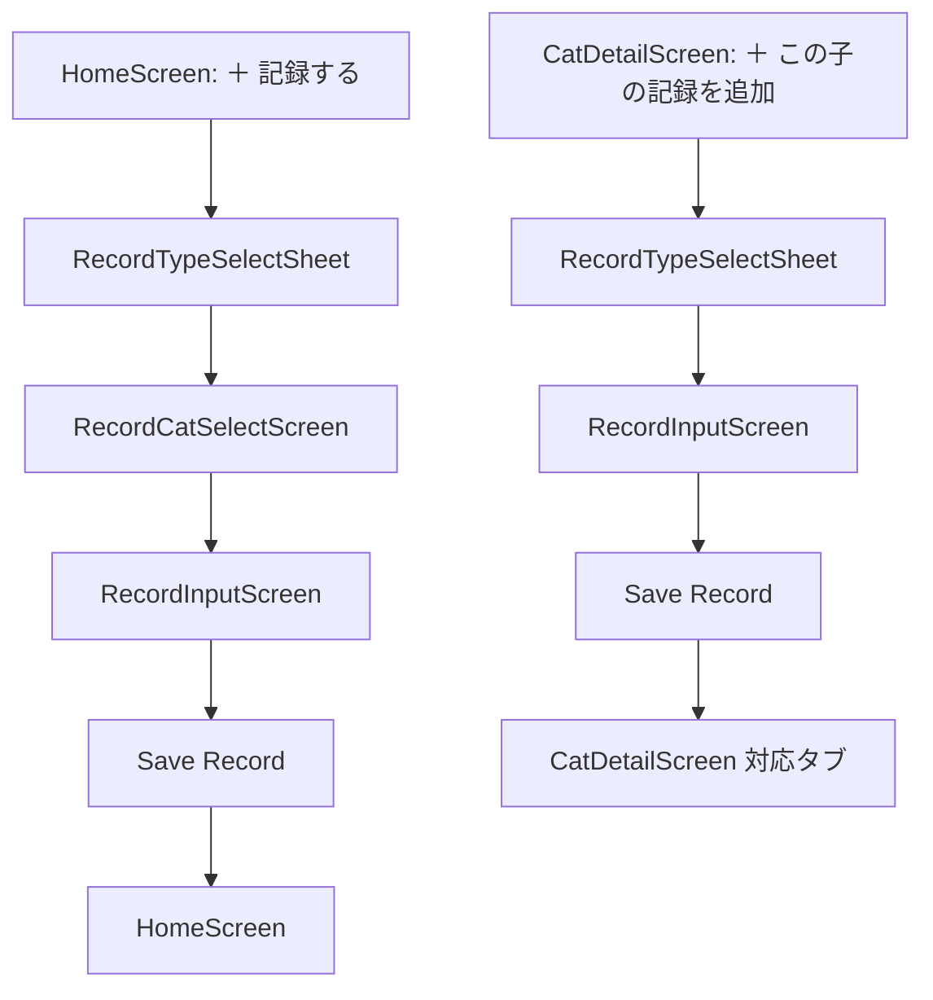

# ねこレコ 記録追加フロー設計

## 目的

このドキュメントは、ねこレコの「記録追加フロー」を Codex で実装するための仕様書です。

記録追加フローは、ねこレコの日常利用の中心となる機能です。  
体重、通院、フード、保険、メモなどを、猫ごとにすばやく記録できることを目的とします。

---

## 基本方針

- その場でサッと記録できることを優先する
- 入力項目は最初から多く見せすぎない
- 詳細項目は任意で追加できるようにする
- ホームから記録する場合は、記録タイプ選択後に猫を選ぶ
- 猫詳細から記録する場合は、対象猫が決まっているため猫選択を省略する
- 保存した記録は、猫詳細の履歴や各カテゴリタブに反映する
- 診察室や日常のお世話中でも使いやすい入力導線にする

---

## 画面一覧

| 画面 / UI | 画面ID / コンポーネントID | 役割 |
|---|---|---|
| 記録タイプ選択シート | `RecordTypeSelectSheet` | 記録タイプを選ぶ |
| 猫選択画面 / シート | `RecordCatSelectScreen` | ホームから記録する際に対象猫を選ぶ |
| 記録入力画面 | `RecordInputScreen` | 記録内容を入力する |
| 記録保存完了 | `RecordSaveCompleteState` | 保存完了後の遷移・表示状態 |
| 離脱確認ダイアログ | `UnsavedChangesDialog` | 入力途中で戻る際の確認 |

---

## 画面フロー



---

# 1. 記録追加の入口

## 1-1. ホームから記録する

## 入口

```text
＋ 記録する
```

## フロー

```text
＋ 記録する
→ 記録タイプを選ぶ
→ 猫を選ぶ
→ 入力
→ 保存
→ ホームへ戻る
```

## 実装メモ

ホームから記録する場合は、対象猫が未確定のため、記録タイプ選択後に猫選択を行う。

---

## 1-2. 猫詳細から記録する

## 入口

```text
＋ この子の記録を追加
```

## フロー

```text
＋ この子の記録を追加
→ 記録タイプを選ぶ
→ 入力
→ 保存
→ 猫詳細の対応タブへ戻る
```

## 実装メモ

猫詳細から記録する場合は `catId` が確定しているため、猫選択をスキップする。

---

# 2. 記録タイプ選択

## コンポーネント名

`RecordTypeSelectSheet`

## 目的

記録したい内容を選択する。

## 表示形式

- Bottom Sheet 推奨
- モーダルでも可
- 画面遷移でも可

初期実装では、ホーム・猫詳細どちらからでも再利用しやすい Bottom Sheet を推奨する。

## タイトル

```text
何を記録しますか？
```

## 記録タイプ

| 表示名 | recordType | MVP優先度 |
|---|---|---:|
| 体重 | `weight` | 高 |
| 通院 | `hospital_visit` | 高 |
| 投薬 | `medication` | 中 |
| フード | `food` | 高 |
| 体調 | `health_condition` | 中 |
| 保険 | `insurance` | 高 |
| メモ | `memo` | 高 |

## 型定義

```ts
type RecordType =
  | 'weight'
  | 'hospital_visit'
  | 'medication'
  | 'food'
  | 'health_condition'
  | 'insurance'
  | 'memo'
```

---

# 3. 猫選択

## 画面ID

`RecordCatSelectScreen`

## 目的

ホームから記録する場合に、対象の猫を選択する。

## 表示条件

以下の場合のみ表示する。

```ts
source === 'home' && catId == null
```

## 表示内容

- タイトル
- 猫一覧
- 検索欄

## タイトル

```text
どの子の記録ですか？
```

## 猫カード表示内容

- 写真
- 名前
- 年齢
- 性別

## 挙動

- 猫カードを選択すると `catId` を確定し、記録入力画面へ遷移する
- 猫詳細から記録する場合、この画面は表示しない

---

# 4. 記録入力画面 共通仕様

## 画面ID

`RecordInputScreen`

## 目的

選択した記録タイプに応じた入力フォームを表示する。

## 共通表示

- 対象猫の写真
- 対象猫の名前
- 記録タイプ名
- 記録日
- メモ
- 保存ボタン

## 共通入力項目

| 項目 | フィールド名 | 型 | 必須 | 初期値 |
|---|---|---:|---:|---|
| 対象猫ID | `catId` | string | 必須 | 選択済み |
| 記録タイプ | `recordType` | RecordType | 必須 | 選択済み |
| 記録日時 | `recordedAt` | datetime | 必須 | 現在日時 |
| メモ | `note` | text | 任意 | 空 |

## 共通ボタン

```text
保存する
キャンセル
```

## 保存後の基本挙動

| 遷移元 | 保存後 |
|---|---|
| ホーム | ホームへ戻る |
| 猫詳細 | 猫詳細の対応タブへ戻る |

---

# 5. 体重記録

## recordType

`weight`

## 目的

診察室や日常で測った体重をすばやく記録する。

## 画面タイトル

```text
体重を記録
```

## 入力項目

| 項目 | フィールド名 | 型 | 必須 | 備考 |
|---|---|---:|---:|---|
| 記録日時 | `recordedAt` | datetime | 必須 | 初期値は現在日時 |
| 体重 | `weightKg` | number | 必須 | kg単位 |
| メモ | `note` | text | 任意 | |

## 表示例

```text
体重を記録
りお

日付：今日
体重：7.65 kg
メモ：ワクチン接種時に測定
```

## バリデーション

- `weightKg` は 0 より大きい数値
- 小数入力を許可する
- 小数点以下2桁程度までを想定
- 極端な値の場合は警告を出してもよい

## 最短導線

```text
体重
→ 数字入力
→ 保存
```

---

# 6. 通院記録

## recordType

`hospital_visit`

## 目的

通院内容、次回予定、保険請求につながる情報を記録する。

## 画面タイトル

```text
通院を記録
```

## 基本入力項目

| 項目 | フィールド名 | 型 | 必須 | 備考 |
|---|---|---:|---:|---|
| 通院日 | `visitedAt` | date | 必須 | 初期値は今日 |
| 病院名 | `hospitalName` | string | 任意 | 過去入力から候補表示できるとよい |
| 内容メモ | `visitNote` | text | 任意 | 診察内容を自由入力 |
| 次回予定日 | `nextVisitDate` | date / null | 任意 | 通知・予定生成に使用 |

## 詳細入力項目

初期表示では折りたたみ、「詳細を追加」で表示する。

| 項目 | フィールド名 | 型 | 必須 | 備考 |
|---|---|---:|---:|---|
| 診断名 | `diagnosisName` | string | 任意 | |
| 処方薬 | `prescribedMedication` | text | 任意 | |
| 検査内容 | `inspectionNote` | text | 任意 | |
| 体重 | `weightKg` | number | 任意 | 同時に体重記録として保存してもよい |
| 金額 | `amount` | number | 任意 | |
| 保険請求ステータス | `insuranceClaimStatus` | InsuranceClaimStatus | 任意 | |
| 領収書写真 | `receiptPhotoUrl` | string / file | 任意 | 初期実装では未対応でも可 |

## 次回予定の入力補助

病院で「次回は○週間後」と言われるケースに対応する。

## 選択肢

```text
1週間後
2週間後
3週間後
4週間後
1ヶ月後
3ヶ月後
日付を選ぶ
```

## 挙動

- 選択すると `visitedAt` を基準に `nextVisitDate` を自動計算する
- 「日付を選ぶ」の場合は日付ピッカーを表示する

## 保存時の追加処理

- `nextVisitDate` がある場合、近日予定またはタスク生成対象にする
- `weightKg` が入力されている場合、体重記録にも反映する設計を検討する
- `insuranceClaimStatus` が `unclaimed` の場合、保険タブ・ホームタスクに反映する

---

# 7. フード記録

## recordType

`food`

## 目的

偏食対策として、食べたフード・食べなかったフードを猫ごとに記録する。

## 画面タイトル

```text
フードを記録
```

## 入力項目

| 項目 | フィールド名 | 型 | 必須 | 備考 |
|---|---|---:|---:|---|
| 記録日時 | `recordedAt` | datetime | 必須 | 初期値は現在日時 |
| フード名 | `foodName` | string | 必須 | |
| ブランド | `brand` | string | 任意 | |
| 味 | `flavor` | string | 任意 | |
| 形状 | `shape` | string | 任意 | ドライ、ウェット、パウチなど |
| 食べたか | `foodStatus` | FoodStatus | 必須 | |
| メモ | `note` | text | 任意 | |

## FoodStatus

```ts
type FoodStatus =
  | 'favorite'
  | 'ate'
  | 'ate_a_little'
  | 'did_not_eat'
  | 'got_bored'
  | 'not_suitable'
```

## 表示文言

| status | 表示名 |
|---|---|
| `favorite` | よく食べる |
| `ate` | 食べた |
| `ate_a_little` | 少し食べた |
| `did_not_eat` | 食べなかった |
| `got_bored` | 飽きた |
| `not_suitable` | 体調に合わなかった |

## 表示例

```text
フードを記録
フード名：○○
ステータス：食べた
メモ：最初は食べたけど半分残した
```

---

# 8. 保険記録

## recordType

`insurance`

## 目的

ペット保険の請求状況を記録し、請求忘れを防ぐ。

## 画面タイトル

```text
保険を記録
```

## 入力項目

| 項目 | フィールド名 | 型 | 必須 | 備考 |
|---|---|---:|---:|---|
| 通院日 | `visitDate` | date | 任意 | |
| 病院名 | `hospitalName` | string | 任意 | |
| 金額 | `amount` | number | 任意 | |
| 診断名 | `diagnosisName` | string | 任意 | |
| 請求ステータス | `claimStatus` | InsuranceClaimStatus | 必須 | 初期値は `unclaimed` |
| メモ | `note` | text | 任意 | |
| 領収書写真 | `receiptPhotoUrl` | string / file | 任意 | 初期実装では未対応でも可 |

## InsuranceClaimStatus

```ts
type InsuranceClaimStatus =
  | 'unclaimed'
  | 'preparing'
  | 'claimed'
  | 'paid'
  | 'not_applicable'
```

## 表示文言

| status | 表示名 |
|---|---|
| `unclaimed` | 未請求 |
| `preparing` | 請求準備中 |
| `claimed` | 請求済み |
| `paid` | 入金済み |
| `not_applicable` | 対象外 |

## 保存時の処理

- `unclaimed` の場合、ホームの今日やることまたは注意表示に反映する
- `claimed` になった場合、未請求タスクを完了扱いにする

---

# 9. メモ記録

## recordType

`memo`

## 目的

自由度の高い記録を残す。

## 画面タイトル

```text
メモを追加
```

## 入力項目

| 項目 | フィールド名 | 型 | 必須 | 備考 |
|---|---|---:|---:|---|
| 記録日時 | `recordedAt` | datetime | 必須 | 初期値は現在日時 |
| タイトル | `title` | string | 任意 | |
| カテゴリ | `memoCategory` | MemoCategory | 必須 | 初期値は `other` |
| メモ | `body` | text | 必須 | |

## MemoCategory

```ts
type MemoCategory =
  | 'personality'
  | 'care'
  | 'away'
  | 'hospital'
  | 'family'
  | 'other'
```

## 表示文言

| category | 表示名 |
|---|---|
| `personality` | 性格 |
| `care` | お世話 |
| `away` | 留守中 |
| `hospital` | 病院 |
| `family` | 家族への申し送り |
| `other` | その他 |

---

# 10. 投薬記録

## recordType

`medication`

## 目的

MVPでは「投薬した記録」を残す。  
詳細な投薬スケジュール管理は将来拡張とする。

## 画面タイトル

```text
投薬を記録
```

## 入力項目

| 項目 | フィールド名 | 型 | 必須 | 備考 |
|---|---|---:|---:|---|
| 記録日時 | `recordedAt` | datetime | 必須 | 初期値は現在日時 |
| 薬名 | `medicationName` | string | 必須 | |
| 量 | `dosage` | string | 任意 | |
| タイミング | `timing` | MedicationTiming | 任意 | |
| 投薬済み | `isGiven` | boolean | 必須 | 初期値 true |
| メモ | `note` | text | 任意 | |

## MedicationTiming

```ts
type MedicationTiming =
  | 'morning'
  | 'noon'
  | 'night'
  | 'before_sleep'
  | 'other'
```

## 表示文言

| timing | 表示名 |
|---|---|
| `morning` | 朝 |
| `noon` | 昼 |
| `night` | 夜 |
| `before_sleep` | 寝る前 |
| `other` | その他 |

---

# 11. 体調記録

## recordType

`health_condition`

## 目的

日常の小さな異変を記録する。

## 画面タイトル

```text
体調を記録
```

## 入力項目

| 項目 | フィールド名 | 型 | 必須 | 備考 |
|---|---|---:|---:|---|
| 記録日時 | `recordedAt` | datetime | 必須 | 初期値は現在日時 |
| 体調カテゴリ | `healthCategory` | HealthCategory | 必須 | |
| 状態 | `conditionStatus` | ConditionStatus | 必須 | |
| メモ | `note` | text | 任意 | |

## HealthCategory

```ts
type HealthCategory =
  | 'appetite'
  | 'vomiting'
  | 'diarrhea'
  | 'excretion'
  | 'drinking'
  | 'energy'
  | 'other'
```

## 表示文言

| category | 表示名 |
|---|---|
| `appetite` | 食欲 |
| `vomiting` | 嘔吐 |
| `diarrhea` | 下痢・軟便 |
| `excretion` | 排泄 |
| `drinking` | 飲水 |
| `energy` | 元気 |
| `other` | その他 |

## ConditionStatus

```ts
type ConditionStatus =
  | 'good'
  | 'normal'
  | 'concern'
  | 'bad'
```

## 表示文言

| status | 表示名 |
|---|---|
| `good` | 良い |
| `normal` | 普通 |
| `concern` | 気になる |
| `bad` | 悪い |

---

# 12. 共通データモデル

## BaseRecord

```ts
type BaseRecord = {
  id: string
  catId: string
  recordType: RecordType
  recordedAt: string
  note?: string | null
  createdAt: string
  updatedAt: string
}
```

---

## WeightRecord

```ts
type WeightRecord = BaseRecord & {
  recordType: 'weight'
  weightKg: number
}
```

---

## HospitalVisitRecord

```ts
type HospitalVisitRecord = BaseRecord & {
  recordType: 'hospital_visit'
  visitedAt: string
  hospitalName?: string | null
  visitNote?: string | null
  nextVisitDate?: string | null

  diagnosisName?: string | null
  prescribedMedication?: string | null
  inspectionNote?: string | null
  weightKg?: number | null
  amount?: number | null
  insuranceClaimStatus?: InsuranceClaimStatus | null
  receiptPhotoUrl?: string | null
}
```

---

## FoodRecord

```ts
type FoodRecord = BaseRecord & {
  recordType: 'food'
  foodName: string
  brand?: string | null
  flavor?: string | null
  shape?: string | null
  foodStatus: FoodStatus
}
```

---

## InsuranceRecord

```ts
type InsuranceRecord = BaseRecord & {
  recordType: 'insurance'
  visitDate?: string | null
  hospitalName?: string | null
  amount?: number | null
  diagnosisName?: string | null
  claimStatus: InsuranceClaimStatus
  receiptPhotoUrl?: string | null
}
```

---

## MemoRecord

```ts
type MemoRecord = BaseRecord & {
  recordType: 'memo'
  title?: string | null
  memoCategory: MemoCategory
  body: string
}
```

---

## MedicationRecord

```ts
type MedicationRecord = BaseRecord & {
  recordType: 'medication'
  medicationName: string
  dosage?: string | null
  timing?: MedicationTiming | null
  isGiven: boolean
}
```

---

## HealthConditionRecord

```ts
type HealthConditionRecord = BaseRecord & {
  recordType: 'health_condition'
  healthCategory: HealthCategory
  conditionStatus: ConditionStatus
}
```

---

## Union Type

```ts
type CatRecord =
  | WeightRecord
  | HospitalVisitRecord
  | FoodRecord
  | InsuranceRecord
  | MemoRecord
  | MedicationRecord
  | HealthConditionRecord
```

---

# 13. 保存後の遷移

## ホームから記録した場合

```ts
navigate('Home')
```

## 猫詳細から記録した場合

記録タイプに応じて、猫詳細の該当タブへ戻る。

| recordType | 戻り先 |
|---|---|
| `weight` | `timeline` |
| `hospital_visit` | `medical` または `timeline` |
| `medication` | `medical` または `timeline` |
| `food` | `food` |
| `health_condition` | `timeline` |
| `insurance` | `insurance` |
| `memo` | `memo` |

推奨：

```ts
navigate('CatDetail', { catId, initialTab })
```

---

# 14. 入力途中の離脱確認

## コンポーネント名

`UnsavedChangesDialog`

## 表示条件

入力済みの項目があり、保存せずに戻ろうとした場合。

## 文言

```text
入力中の内容があります
保存せずに戻りますか？
```

## ボタン

```text
戻らない
保存せずに戻る
```

## 挙動

- 「戻らない」：ダイアログを閉じて入力画面に戻る
- 「保存せずに戻る」：入力内容を破棄して前の画面へ戻る

---

# 15. エラー・ローディング

## 保存中

- 保存ボタンを disabled にする
- 二重送信を防ぐ
- ボタン文言を変更してもよい

```text
保存中...
```

## 保存失敗

```text
保存できませんでした
時間をおいてもう一度お試しください。
```

ボタン：

```text
もう一度保存する
```

---

# 16. 並び順・反映先

## 履歴タブ

すべての記録は、猫詳細の履歴タブに `recordedAt` 降順で表示する。

## 各カテゴリへの反映

| recordType | 反映先 |
|---|---|
| `weight` | 履歴タブ、将来的には体重グラフ |
| `hospital_visit` | 医療タブ、履歴タブ、保険タブ |
| `medication` | 医療タブ、履歴タブ |
| `food` | ごはんタブ、履歴タブ |
| `health_condition` | 履歴タブ |
| `insurance` | 保険タブ、履歴タブ、ホームタスク |
| `memo` | メモタブ、履歴タブ |

---

# 17. 将来拡張

初期実装後、以下の拡張を想定する。

- 投薬スケジュール
- 投薬リマインダー
- 家族の誰が記録したか
- 領収書写真アップロード
- 同じ記録を複数猫にコピー
- 通院記録から保険請求を自動作成
- 体重グラフ
- 血液検査数値の管理
- 通知連携
- 下書き保存
- 音声入力
- 写真つきメモ

---

# 18. 推奨コンポーネント

## 画面コンポーネント

- `RecordInputScreen`
- `RecordCatSelectScreen`

## シート・モーダル

- `RecordTypeSelectSheet`
- `UnsavedChangesDialog`

## 入力フォーム

- `WeightRecordForm`
- `HospitalVisitRecordForm`
- `FoodRecordForm`
- `InsuranceRecordForm`
- `MemoRecordForm`
- `MedicationRecordForm`
- `HealthConditionRecordForm`

## 共通UI

- `CatAvatar`
- `RecordTypeOption`
- `DateInput`
- `DateTimeInput`
- `TextInput`
- `NumberInput`
- `TextArea`
- `RadioGroup`
- `SelectChip`
- `PrimaryButton`
- `SecondaryButton`
- `ErrorText`
- `LoadingOverlay`

---

# 19. 受け入れ条件

## 入口

- ホーム画面の「＋ 記録する」から記録タイプ選択シートが開く
- 猫詳細画面の「＋ この子の記録を追加」から記録タイプ選択シートが開く
- ホームから記録する場合、記録タイプ選択後に猫選択へ進む
- 猫詳細から記録する場合、猫選択をスキップする

## 体重記録

- 体重を入力して保存できる
- 体重は 0 より大きい数値のみ保存できる
- 保存後、履歴タブに反映される

## 通院記録

- 通院日、病院名、内容メモ、次回予定を保存できる
- 「4週間後」などの選択肢から次回予定日を自動設定できる
- 保存後、医療タブまたは履歴タブに反映される

## フード記録

- フード名と食べたかステータスを保存できる
- 食べた / 食べなかった / 飽きたなどの状態を選択できる
- 保存後、ごはんタブに反映される

## 保険記録

- 請求ステータスを保存できる
- 未請求、請求準備中、請求済み、入金済み、対象外を選択できる
- 未請求の場合、保険タブまたはホーム上で注意表示できる

## メモ記録

- メモ本文を保存できる
- カテゴリを選択できる
- 保存後、メモタブに反映される

## 投薬記録

- 薬名、量、タイミング、投薬済み状態を保存できる
- 保存後、医療タブまたは履歴タブに反映される

## 体調記録

- 体調カテゴリと状態を保存できる
- 保存後、履歴タブに反映される

## 共通

- 記録日時は初期値として現在日時が入る
- 保存中は保存ボタンが disabled になる
- 保存失敗時はエラーメッセージが表示される
- 入力途中で戻ろうとした場合、確認ダイアログが表示される

---

# 20. 初期実装でやること

初期実装では、以下を対象とする。

- 記録タイプ選択
- ホームからの記録追加導線
- 猫詳細からの記録追加導線
- 猫選択画面
- 体重記録
- 通院記録
- フード記録
- 保険記録
- メモ記録
- 投薬記録の簡易版
- 体調記録の簡易版
- 保存後の画面遷移
- 入力途中の離脱確認
- 保存中・保存失敗状態
- ローカルまたは仮データでの表示確認

---

# 21. 初期実装ではやらないこと

以下は初期実装では対象外とする。

- 投薬スケジュールの繰り返し設定
- 通知の実送信
- 家族の誰が記録したかの管理
- 領収書画像アップロード
- 同じ記録を複数猫にコピー
- 体重グラフ
- 血液検査数値管理
- 音声入力
- 下書き保存
- オフライン同期
- 複数端末同期

ただし、将来的に追加できるように、データ構造とコンポーネントは拡張しやすくしておく。
